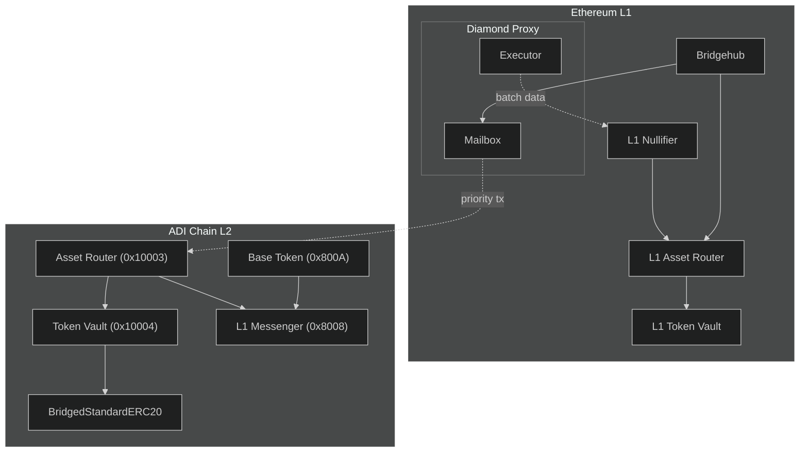
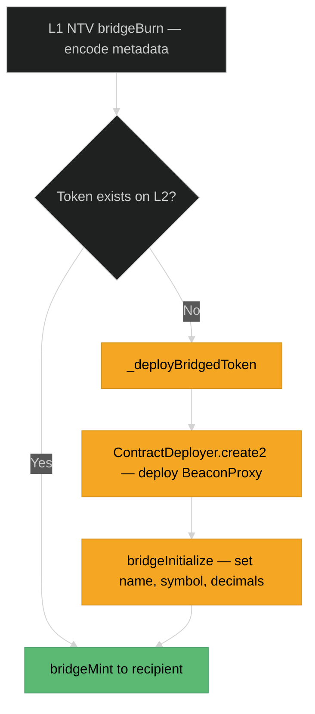
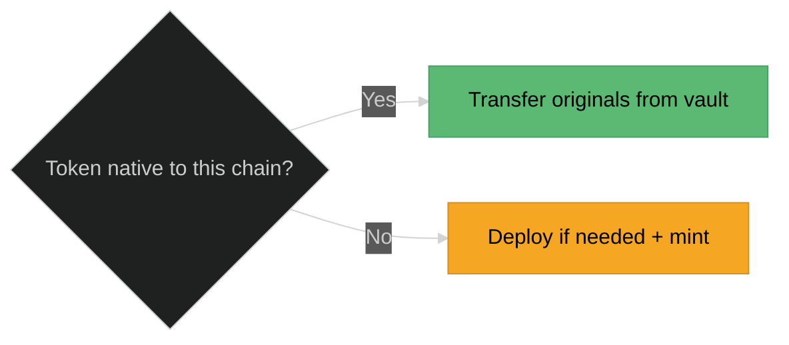

# Canonical Bridge Technical Reference

This page covers the contract-level details of the ADI Canonical Bridge. For a high-level overview of how deposits and withdrawals work, see [The Bridge](../how-to-start/the-bridge.md).

---

## Bridge Methods Reference

### Deposits (L1 → L2)

#### ADI Base Token Deposit

The native path for depositing ADI — the chain's base token.

| Step | Called By | Method | Contract | Description |
|------|----------|--------|----------|-------------|
| 1 | User | `approve(spender, amount)` | ADI ERC20 (L1) | Authorize the bridge to spend your ADI |
| 2 | User | `requestL2TransactionDirect(request)` | Bridgehub | Initiate the deposit. `msg.value` must be 0 (ADI is ERC20, not ETH) |
| 3 | Bridgehub | `bridgehubDepositBaseToken(chainId, assetId, caller, amount)` | L1 Asset Router | Routes the base token deposit |
| 4 | Asset Router | `bridgeBurn(chainId, msgValue, assetId, caller, data)` | L1 Native Token Vault | Locks ADI via `safeTransferFrom()`. Updates `chainBalance` accounting |
| 5 | Bridgehub | `bridgehubRequestL2Transaction(request)` | Mailbox | Creates the L2 priority transaction. Validates `mintValue >= baseCost + l2Value`. Emits `NewPriorityRequest` |
| 6 | Bootloader | `mint(account, amount)` | L2 Base Token (0x800A) | Mints native ADI balance on L2. Only callable by the bootloader |

**Key parameter**: `mintValue` — the total amount of ADI to mint on L2. Must cover both L2 gas costs (`baseCost`) and the deposit value (`l2Value`).

#### ERC20 Token Deposit

Uses the **Two Bridges** pattern — one bridge handles ADI for L2 gas, the other handles the ERC20 token.

| Step | Called By | Method | Contract | Description |
|------|----------|--------|----------|-------------|
| 1 | User | `approve(spender, amount)` | ERC20 Token (L1) | Authorize for the token amount |
| 2 | User | `approve(spender, mintValue)` | ADI ERC20 (L1) | Authorize for L2 gas costs |
| 3 | User | `requestL2TransactionTwoBridges(request)` | Bridgehub | Initiates dual-bridge deposit |
| 4 | Bridgehub | `bridgehubDepositBaseToken(...)` | L1 Asset Router | First bridge: locks ADI for L2 gas |
| 5 | Bridgehub | `bridgehubDeposit(chainId, caller, value, data)` | L1 Asset Router | Second bridge: locks ERC20. Rejects if `assetId == baseTokenAssetId` |
| 6 | Asset Router | `bridgeBurn(...)` | L1 Native Token Vault | Locks ERC20 via `safeTransferFrom()`. Fetches token metadata (name, symbol, decimals) for L2 deployment |
| 7 | Bridgehub | `bridgehubRequestL2Transaction(request)` | Mailbox | Creates L2 priority tx targeting L2 Asset Router |
| 8 | Bootloader | `finalizeDeposit(chainId, assetId, data)` | L2 Asset Router (0x10003) | Receives the deposit on L2 |
| 9 | Asset Router | `bridgeMint(chainId, assetId, data)` | L2 Native Token Vault (0x10004) | If first time: deploys `BridgedStandardERC20` via CREATE2. Then mints tokens to recipient |

After the Mailbox creates the L2 transaction, the L1 Asset Router records the deposit via `bridgehubConfirmL2Transaction()`, storing `depositHappened[chainId][canonicalTxHash] = txDataHash`.

### Withdrawals (L2 → L1)

#### ADI Base Token Withdrawal

| Step | Called By | Method | Contract | Description |
|------|----------|--------|----------|-------------|
| 1 | User | `withdraw(l1Receiver)` | L2 Base Token (0x800A) | Payable — send ADI as `msg.value`. Burns the ADI on L2 |
| 2 | L2 Base Token | `sendToL1(message)` | L1 Messenger (0x8008) | Records 56-byte withdrawal message. Creates L2→L1 log with `sender=0x8008`, `key=0x800A` |
| — | ADI Server | *Batch processing* | Executor | Commit → Prove → Execute batch on L1 |
| 3 | User | `finalizeDeposit(params)` | L1 Nullifier | Verifies Merkle proof. Sets `isWithdrawalFinalized = true`. Parses the withdrawal message |
| 4 | Nullifier | `finalizeDeposit(chainId, assetId, data)` | L1 Asset Router | Routes to Token Vault |
| 5 | Asset Router | `bridgeMint(chainId, assetId, data)` | L1 Native Token Vault | Decreases `chainBalance`. Calls `safeTransfer()` to send ADI ERC20 to the L1 receiver |

**Withdrawal message format** (56 bytes, `abi.encodePacked`):

```
+------------+----------------------+----------------------------------+
|  4 bytes   |      20 bytes        |           32 bytes               |
|  selector  |    l1Receiver        |       amount (wei)               |
| 0x6c0960f9 |  (packed address)    |        (uint256)                 |
+------------+----------------------+----------------------------------+
```

#### ERC20 Token Withdrawal

| Step | Called By | Method | Contract | Description |
|------|----------|--------|----------|-------------|
| 1 | User | `withdraw(assetId, assetData)` | L2 Asset Router (0x10003) | `assetData = encode(amount, l1Receiver, l2TokenAddress)` |
| 2 | Asset Router | `bridgeBurn(chainId, msgValue, assetId, caller, data)` | L2 Native Token Vault (0x10004) | Calls `BridgedStandardERC20.bridgeBurn()` to destroy tokens. Encodes `bridgeMintData` with token metadata |
| 3 | Asset Router | `sendToL1(message)` | L1 Messenger (0x8008) | Records L2→L1 message with `key = L2AssetRouter address` |
| — | ADI Server | *Batch processing* | Executor | Commit → Prove → Execute batch on L1 |
| 4 | User | `finalizeDeposit(params)` | L1 Nullifier | Verifies proof. Parses the Asset Router message format. `l2Sender` = L2 Asset Router (0x10003) |
| 5 | Nullifier | `finalizeDeposit(chainId, assetId, data)` | L1 Asset Router | Routes to Token Vault |
| 6 | Asset Router | `bridgeMint(chainId, assetId, data)` | L1 Native Token Vault | Decreases `chainBalance`. Calls `safeTransfer()` to send ERC20 to the L1 receiver |

**Note on L2-native tokens**: If the token is native to L2, the user must approve `L2NativeTokenVault (0x10004)` to pull tokens (because NTV uses `safeTransferFrom` rather than burn).

---

## How It Works on Contracts

This section provides a deeper technical look at the smart contract architecture — the exact contracts involved, their roles, and how they interact.

### Contract Architecture



### L1 Contracts

#### Bridgehub

The central coordination hub. All deposits enter through one of two functions:

| Function | When Used | Key Behavior |
|----------|-----------|--------------|
| `requestL2TransactionDirect(request)` | ADI base token deposits | Requires `msg.value == 0` for non-ETH base token. Calls `bridgehubDepositBaseToken()` then creates priority tx |
| `requestL2TransactionTwoBridges(request)` | ERC20 token deposits | First bridge locks ADI for gas, second bridge locks ERC20. Creates priority tx targeting L2 Asset Router |

Both functions end by calling the **Mailbox** to queue the L2 transaction.

#### L1 Asset Router

Routes deposits and withdrawals to the appropriate **asset handler** (usually the Native Token Vault):

| Function | Access | Purpose |
|----------|--------|---------|
| `bridgehubDepositBaseToken(chainId, assetId, caller, amount)` | Bridgehub only | Handles base token deposits |
| `bridgehubDeposit(chainId, caller, value, data)` | Bridgehub only | Handles ERC20 deposits. Guards against depositing the base token through this path |
| `finalizeDeposit(chainId, assetId, transferData)` | Nullifier only | Processes withdrawal claims — releases tokens via the Token Vault |

Supports two encoding versions for deposit calldata: `0x00` (legacy) and `0x01` (new format with assetId).

#### L1 Native Token Vault

Custodies all locked tokens and enforces strict accounting:

| Function | Access | Purpose |
|----------|--------|---------|
| `bridgeBurn(chainId, msgValue, assetId, caller, data)` | Asset Router only | Locks tokens via `safeTransferFrom()`. Increments `chainBalance[chainId][assetId]`. Returns `bridgeMintData` for L2 |
| `bridgeMint(chainId, assetId, data)` | Asset Router only | Releases tokens via `safeTransfer()`. Decrements `chainBalance`. Validates sufficient chain balance |
| `ensureTokenIsRegistered(token)` | Public | Auto-registers unknown tokens. Computes assetId and stores mappings |

The `chainBalance` mapping is the core security invariant: **withdrawals from chain X can never exceed deposits to chain X**, enforced per-asset.

#### L1 Nullifier

The gatekeeper for withdrawal claims:

| Function | Access | Purpose |
|----------|--------|---------|
| `finalizeDeposit(FinalizeL1DepositParams)` | Public | Verifies proof, marks as finalized, forwards to Asset Router |

Uses a triple-nested mapping `isWithdrawalFinalized[chainId][batchNumber][messageIndex]`. Once set to `true`, the same withdrawal can never be claimed again — even if the same proof is resubmitted.

Supports three withdrawal message formats:

| Format | Selector | Used By |
|--------|----------|---------|
| Base token | `0x6c0960f9` (`finalizeEthWithdrawal`) | L2 Base Token withdrawals |
| Legacy ERC20 | `finalizeWithdrawal` | Old L2 shared bridge withdrawals |
| New Asset Router | `finalizeDeposit` | ERC20 withdrawals via L2 Asset Router |

#### Mailbox (Diamond Facet)

Handles L1↔L2 message passing:

| Function | Purpose |
|----------|---------|
| `bridgehubRequestL2Transaction(request)` | Creates L2 priority transaction. Validates `mintValue >= baseCost + l2Value`. Derives L2 gas price with ADI/ETH exchange rate |
| `proveL2MessageInclusion(batch, index, message, proof)` | Verifies L2→L1 message Merkle proof against stored `l2LogsRootHashes[batchNumber]` |

#### Executor (Diamond Facet)

Processes the batch lifecycle on L1:

| Function | Purpose |
|----------|---------|
| `commitBatchesSharedBridge()` | Posts batch data to L1. Validates L2 system logs, DA proof |
| `proveBatchesSharedBridge()` | Verifies ZK proof via on-chain verifier contract |
| `executeBatchesSharedBridge()` | Finalizes batch. Stores `l2LogsRootHashes` for Merkle proof verification. Processes priority operations |

### L2 Contracts

#### L2 Base Token (0x800A)

The native ADI system contract:

| Function | Purpose |
|----------|---------|
| `withdraw(address _l1Receiver) payable` | Burns `msg.value` of ADI. Creates 56-byte withdrawal message via L1 Messenger. Emits `Withdrawal` |
| `mint(address _account, uint256 _amount)` | Called only by bootloader during deposits. Increases native balance |

#### L2 Asset Router (0x10003)

Processes ERC20 deposits and initiates ERC20 withdrawals:

| Function | Access | Purpose |
|----------|--------|---------|
| `finalizeDeposit(chainId, assetId, data)` | Aliased L1 Asset Router only | Receives L1→L2 deposit. Routes to L2 Native Token Vault |
| `withdraw(assetId, assetData)` | Public | Initiates ERC20 withdrawal. Burns tokens, sends L2→L1 message |

#### L2 Native Token Vault (0x10004)

Manages bridged ERC20 token representations:

| Function | Access | Purpose |
|----------|--------|---------|
| `bridgeMint(chainId, assetId, data)` | Asset Router only | For first-time tokens: deploys `BridgedStandardERC20` via CREATE2. Mints tokens to recipient |
| `bridgeBurn(chainId, msgValue, assetId, caller, data)` | Asset Router only | Burns `BridgedStandardERC20` tokens. Encodes `bridgeMintData` for L1 claim |

#### L1 Messenger (0x8008)

Records all L2→L1 messages and builds the Merkle tree:

| Function | Purpose |
|----------|---------|
| `sendToL1(message)` | Records message. Creates `L2ToL1Log{sender=0x8008, key=msg.sender, value=keccak256(message)}`. Adds to batch Merkle tree |
| `publishPubdataAndClearState()` | Called by bootloader at end of batch. Builds a fixed-size Merkle tree of 16,384 leaves. Sends root to L1 |

---

## First-Time Token Bridging

When a token is bridged to a chain where it has never existed before, the bridge automatically deploys a new ERC20 contract. This uses the **BeaconProxy** pattern — all bridged tokens share a single upgradeable implementation, making coordinated upgrades possible.

### How It Works

When the L2 Native Token Vault receives a deposit for a token that doesn't yet exist on L2, it:

1. Computes a deterministic address using CREATE2
2. Deploys a `BridgedStandardERC20` as a BeaconProxy
3. Initializes the token with metadata (name, symbol, decimals) from the deposit data
4. Mints the deposited amount to the recipient



The same process works in reverse: if an L2-native token is bridged to L1, the L1 Native Token Vault deploys a `BridgedStandardERC20` using standard Ethereum CREATE2.

### Deterministic Addresses

Bridged token addresses are fully deterministic — given the same inputs, the same token will always deploy to the same address on any chain.

**On L2 (ZKsync CREATE2)**:
```
address = keccak256(
    keccak256("zksyncCreate2") ||
    L2NTV (0x10004) ||
    salt ||
    L2_TOKEN_PROXY_BYTECODE_HASH ||
    keccak256(abi.encode(beaconAddress, ""))
)
```

**On L1 (Standard CREATE2)**:
```
address = keccak256(
    0xff ||
    L1NTV ||
    salt ||
    keccak256(BeaconProxy.creationCode + abi.encode(beacon, ""))
)
```

The **salt** depends on token origin:
- From L1 to L2: `bytes32(uint256(uint160(l1TokenAddress)))` — the address padded to 32 bytes
- From other chains: `keccak256(abi.encode(originChainId, tokenAddress))`

This means the same L1 token deployed across multiple L2 chains within the same ecosystem will have **identical L2 addresses**.

### Return Trip: No New Deployment

When a token returns to its origin chain (e.g., withdraw an L1-native token back to L1), no new contract is deployed:



---

## Asset ID System

Every bridged token is identified by a deterministic `bytes32` asset ID:

```
assetId = keccak256(abi.encode(originChainId, L2_NATIVE_TOKEN_VAULT_ADDRESS, tokenAddress))
```

Where `L2_NATIVE_TOKEN_VAULT_ADDRESS` = `0x10004` is used as the asset deployment tracker on both L1 and L2, ensuring the same asset ID resolves identically on both chains.

| Token | originChainId | tokenAddress |
|-------|---------------|--------------|
| ADI (base token) | L1 chain ID (e.g. 11155111 for Sepolia) | L1 ADI ERC20 address |
| Any L1-native ERC20 | L1 chain ID | L1 token address |
| L2-native ERC20 | L2 chain ID (e.g. 36900) | L2 token address |

### Chain Balance Tracking

The L1 Native Token Vault maintains strict per-chain, per-token accounting:

```solidity
mapping(uint256 chainId => mapping(bytes32 assetId => uint256)) public chainBalance;
```

- Incremented on deposit (tokens locked on source chain)
- Decremented on withdrawal finalization (tokens released on destination)
- Prevents cross-chain theft: one ZK chain can't drain another's deposits
- Skipped when token originates from that chain (`_hasInfiniteBalance`)

---

## Security Guarantees

The canonical bridge provides the following security properties:

**Trustless verification** — Every withdrawal is backed by a zero-knowledge proof verified on Ethereum. No trusted operator, multisig, or oracle is involved in the verification process.

**Double-claim prevention** — The nullifier pattern ensures each withdrawal can be claimed exactly once. The `isWithdrawalFinalized[chainId][batchNumber][messageIndex]` mapping is irreversible.

**1:1 asset backing** — The `chainBalance` accounting in the L1 Native Token Vault guarantees that tokens released on L1 never exceed tokens deposited from L1. This is enforced at the contract level per-chain and per-asset.

**Address aliasing** — L1 contract addresses are aliased on L2 (offset by `0x1111...1111`) to prevent impersonation attacks where an L1 contract could forge L2 messages.

**Access control** — Every sensitive function is protected by strict modifiers: `onlyBridgehub`, `onlyNullifier`, `onlyAssetRouter`, `onlyCallFromBootloader`. No external actor can directly mint, burn, or release tokens.

**Deterministic token deployment** — Bridged token addresses are computed via CREATE2, making them predictable and verifiable before any transaction is sent.

**Pausability** — All bridge contracts inherit OpenZeppelin's `PausableUpgradeable`, allowing emergency stops if a critical issue is discovered.
