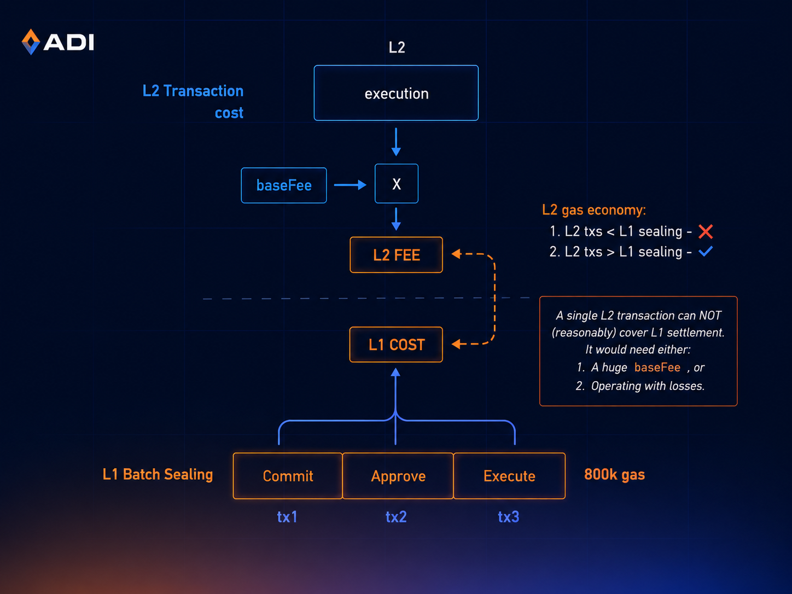
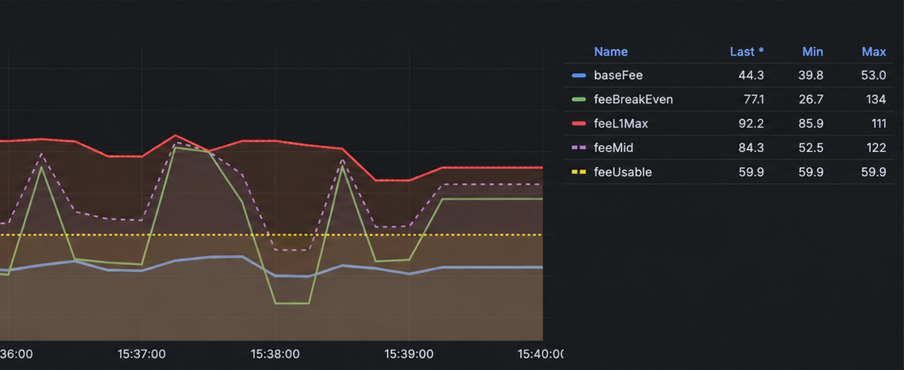

# Gas Model

ADI gas economics is built around a single goal: an L2 base fee that is **sane** for users,
**competitive** with L1, and **profitable** for the chain, all at the same time.

This page walks through the anchors and block-to-block dynamics that produce the [final `baseFee` formula](#final-basefee-formula).


**TL;DR:** The base fee is pulled by two forces:
1. a slow gravitational pull toward a profitability center `feeMid`,
2. an EIP-1559-style reaction to demand.


## L2 Economy

The price for a single L2 transaction is just:

$$
\text{txFee} = \text{L2 gas} \times \text{baseFee}
$$

ADI's approach is intentionally generic: each transaction's `gas × baseFee` is what stands against the chain's system
spending across a batch. There is no separate line item for L1 pubdata
(the bytes the transaction commits to the L1 state diff); pubdata cost is implicitly accounted for inside the gas.
*The entire economics lives in `baseFee`.*


**Profitability rule.** Across a sealed batch, the total L2 fees must cover the L1 sealing cost plus infrastructure spending.


$$
\text{batchCost}_{L1} + \text{infraCost} \;\leq\; \text{baseFee}_{L2} \cdot \sum_{i=1}^{N} \text{gas}_{L2,i}
$$

<figure>
  
  <figcaption><p>Each L2 transaction's <code>gas × baseFee</code> revenue, collected across a batch,
must cover the three L1 transactions (commit / approve / execute) that seal it.</p></figcaption>
</figure>

Two extremes follow from this inequality:

1. **Few transactions per batch.** The chain is non-profitable unless `baseFee` is set high.
2. **Many transactions per batch.** The chain is profitable even with a low `baseFee`.

Generally speaking, it doesn't matter exactly how the chain prices a unit of gas
as long as the price is reasonable (proportional to EVM ops, proving, verifying, and so on).

## Three Pricing Anchors

The base fee is shaped by three economic anchors. *None of them is a hard cap*,
and each is a **gravity point** that pulls the price with a different weight.

<figure>
  
  <figcaption><p>Live <code>baseFee</code> drifting between its three anchors over a measurement window.</p></figcaption>
</figure>

| Base fee anchors               | Definition                                    | Role                | Weight |
| ------------------------------ | --------------------------------------------- | ------------------- | :----: |
| `feeUsable` (Usability target) | Theoretical "sane" fee from typical use cases | Stable center       |  1/2   |
| `feeL1Max` (Soft MAX)          | L1 gas price converted to L2 scale            | Profitable ceiling  |  1/3   |
| `feeBreakEven` (Soft MIN)      | L2 break-even fee (noisiest metric)           | Profitability floor |  1/6   |

In normal conditions, we'd expect:

$$
\text{feeBreakEven} \;\leq\; \text{baseFee}_{L2} \;\leq\; \text{feeUsable} \;\leq\; \text{feeL1Max}
$$

In practice, the break-even price can exceed the L1-derived cap (`min > max`), for example, during low-activity windows
when there aren't enough transactions to cover the chain's expenses. This is why the anchors are **gravity points**,
not hard limits, and why the formula gravitates toward a geometric mean rather than clipping.

### `feeUsable`: theoretical sane fee

We curate a basket of 16 representative on-chain operations, each tagged with a typical gas cost
and a target USD cost the user should pay for it. For each operation, we solve for the gas price
that hits its target, then take a weighted average across the basket:

$$
\text{price}_i = \frac{\text{targetCost}_i}{\text{gasUsed}_i \cdot \text{adiUsdPrice}}
$$

$$
\text{feeUsable} = \sum_{i=1}^{n} \frac{\text{price}_i \cdot \text{weight}_i}{n}
$$

The example of a basket in the operator config:



| Operation                 |     Gas | Target cost (USD) | Weight |
| ------------------------- | ------: | ----------------: | :----: |
| `native_transfer`         |  21,000 |             0.004 |   1    |
| `erc20_approve`           |  45,000 |             0.008 |   1    |
| `erc20_transferFrom`      |  65,000 |             0.012 |   1    |



```typescript
export const DEFAULT_BASEMAX_OPERATIONS: BaseMaxOperation[] = [
  { operationType: "native_transfer",         gasUsed:  21_000, targetCostUsd: 0.004, weight: 1 },
  { operationType: "erc20_approve",           gasUsed:  45_000, targetCostUsd: 0.008, weight: 1 },
  { operationType: "erc20_transferFrom",      gasUsed:  65_000, targetCostUsd: 0.012, weight: 1 },
];
```



This is the most stable input to `feeMid` and therefore carries the largest weight.

### `feeL1Max`: soft maximum

We define the “maximum fee” as the **L1 chain's gas price** converted to L2 scale.:

$$
\text{feeL1Max} = \frac{\text{L1 gas price}}{\text{adiEthRatio}}
$$

The idea is that the L2 chain is NOT generally be considered attractive
if its gas price is higher than the L1 gas price.

`feeL1Max` is therefore a "good high value" that we don't want the base fee to drift far above.

### `feeBreakEven`: soft minimum (profit floor)


**Definition.** The break-even fee is the L2 gas price at which the network stops operating at a loss.


We want L2 revenue to cover L1 expenses:

1. L2 revenue ≥ L1 expenses
2. `baseFee` ≥ L1 expenses ÷ L2 gas

$$
\text{feeBreakEven}_{L2} \;\geq\; \frac{\text{batchGas}_{L1} \cdot \text{gasPrice}_{L1} + \text{infraCost}_{batch}}{N \cdot \bar{g}}
$$

where `N` is the average number of L2 transactions in a sealed batch and `g` is the average gas per L2 transaction. The infrastructure cost is amortized per batch:

$$
\text{infraCost}_{batch} = \frac{\text{infraCost}_{year} \cdot \text{avgBatchTime}_{sec} \cdot 10^{18}_{wei}}{31{,}536{,}000_{sec} \cdot \text{ethPriceUsd}}
$$

`feeBreakEven` is a useful starting point but has well-known rough edges:


**Corner cases.**

1. `feeBreakEven` can be much **lower** than `feeL1Max` (low cost, low load).
2. `feeBreakEven` can **exceed** `feeL1Max` (`min > max`).
3. `feeBreakEven` can **change sharply** between measurement windows.
4. **Cold start.** With near-zero TPS, `feeBreakEven` can blow up to billions of gwei.

