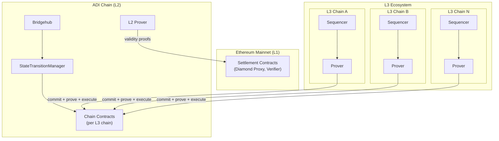
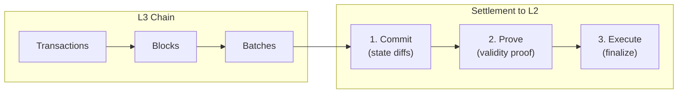
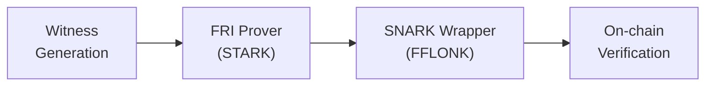

# L3 Chain Architecture

## Overview

An L3 chain is a Layer 3 ZK rollup that settles on the ADI Chain (L2), which itself settles on Ethereum Mainnet (L1). This creates a layered security model where L3 transactions inherit cryptographic guarantees from both L2 and L1.


L3 chains inherit security guarantees from both the ADI Chain (L2) and Ethereum Mainnet (L1) through validity proofs at each layer.


**Settlement hierarchy:**

```
Ethereum Mainnet (L1)
        ▲
        │ validity proofs
        │
   ADI Chain (L2)
        ▲
        │ validity proofs
        │
   L3 Chains (Client)
```

Each L3 chain operates as an independent ZK rollup with its own sequencer, prover, and state. Multiple L3 chains can be deployed within a single L3 ecosystem, sharing common infrastructure contracts while maintaining isolated execution environments.

## Architecture

The following diagram illustrates the multi-chain L3 ecosystem architecture:



### Component Responsibilities

| Component              | Layer | Purpose                                          |
| ---------------------- | ----- | ------------------------------------------------ |
| Sequencer              | L3    | Orders transactions, produces L3 blocks          |
| Prover                 | L3    | Generates validity proofs for L3 batches         |
| Chain Contracts        | L2    | Verifies L3 proofs, stores L3 state roots        |
| StateTransitionManager | L2    | Manages chain registration and upgrades          |
| Bridgehub              | L2    | Central registry for all L3 chains               |
| L2 Prover              | L2    | Proves L2 state (including L3 settlements) to L1 |

## Settlement Flow

Each layer processes transactions through a batch lifecycle with three stages: **commit**, **prove**, and **execute**.

### Batch Lifecycle Stages





The sequencer submits batch data to L2. This includes state diffs (changes to storage slots) rather than full state, optimizing data costs.

**Data submitted:**
- Storage slot changes (key-value pairs)
- Contract deployments
- L2 → L3 message hashes



The prover generates a validity proof for the committed batch. This proof cryptographically guarantees that the state transition is valid according to the L3 execution rules.

**Proof contains:**
- Execution correctness attestation
- State root transition validity
- Public inputs for verification



After proof verification, the batch is finalized on L2. The L3 state root is updated in the chain contracts.

**Result:**
- New state root stored on L2
- Batch marked as finalized
- Withdrawals become processable



### Finality Propagation

Finality flows upward through the layers:

| Event                              | Confirmation Type | Timing  |
| ---------------------------------- | ----------------- | ------- |
| Transaction included in L3 block   | Soft confirmation | Seconds |
| L3 batch committed to L2           | L2 confirmation   | Minutes |
| L3 batch proved and executed on L2 | L2 finality       | Minutes |
| L2 batch proved and executed on L1 | L1 finality       | Hours   |


Soft confirmations provide immediate usability. Users can transact with transferred assets immediately after submission, while cryptographic finality propagates through the layers over time.


## Proving Architecture

Both L3 and L2 layers generate validity proofs using the ZkSync proving system.

### Proof Generation Pipeline



**Proving stages:**

1. **Witness Generation**: The prover extracts execution traces from batch processing.

2. **FRI Proving**: Fast Reed-Solomon Interactive Oracle Proofs (FRI) generate STARK proofs. This stage is computationally intensive and benefits from GPU parallelization.

3. **SNARK Wrapper**: The FRI proof is wrapped in a FFLONK SNARK for efficient on-chain verification. This reduces verification gas costs on the settlement layer.

### L3 vs L2 Proving

| Aspect     | L3 Proving         | L2 Proving                    |
| ---------- | ------------------ | ----------------------------- |
| Proves     | L3 batch execution | L2 execution + L3 settlements |
| Settles to | ADI Chain (L2)     | Ethereum (L1)                 |
| Operator   | Client or ADI      | ADI                           |

Each L3 chain operates its own prover independently. The L2 prover aggregates all L3 settlement activity along with native L2 transactions into proofs submitted to Ethereum.

### Hardware Requirements

Proof generation requires GPU acceleration.

### Hardware Specifications

| Component    | Minimum     | Recommended   |
| ------------ | ----------- | ------------- |
| GPU Memory   | 70 GB       | 140 GB        |
| GPU Model    | NVIDIA H100 | NVIDIA H200   |
| FRI Provers  | 1           | 2 (parallel)  |
| SNARK Prover | 1 (33 GB)   | 1 (dedicated) |

**Performance characteristics:**
- FRI proving time scales inversely with GPU memory
- SNARK proving requires approximately 33 GB regardless of total memory
- Parallel FRI + SNARK execution improves throughput by 15-20%
- Target throughput: ~15-20 TPS per prover configuration


For production deployments, running FRI and SNARK provers in parallel on separate GPU partitions maximizes batch throughput.


## Key Contracts

The L3 ecosystem deploys several contract types on the settlement layer (L2).

### Bridgehub

Central registry that tracks all chains in the ecosystem. Provides chain ID to contract address mapping, cross-chain message routing, and ecosystem-wide configuration.

### StateTransitionManager (STM)

Manages the state transition logic for chains. Registers new chains in the ecosystem, handles protocol upgrades, and maintains shared verification parameters.

### Diamond Proxy

Each L3 chain has a Diamond Proxy contract implementing batch commitment and verification, state root storage, validator management, and upgrade mechanisms via the facet pattern. The Diamond pattern enables modular upgrades where individual facets (execution, getters, admin) can be replaced independently.

### Validator Timelock

Security mechanism that enforces a delay between batch commitment and execution. This prevents immediate finalization of malicious batches, allows time for monitoring systems to detect anomalies, and supports configurable delay periods per chain.

## Data Availability

L3 chains use **calldata** mode for data availability.


L3 chains cannot use blob transactions because the ADI Chain (L2) runs on ZkSync, which does not support EIP-4844 blobs.


### How It Works

When a batch is committed, the sequencer posts compressed state diffs as calldata in the commitment transaction to L2. This data includes changed storage slot keys and values, contract bytecode deployments, and L2 → L3 message data.

### Why Calldata

Calldata mode ensures full data availability for state reconstruction, removes dependency on external DA layers, and provides verifiable data posting in the same transaction as commitment.

### Data Costs

Calldata costs are paid in L2 gas. The state diff compression reduces data size significantly compared to posting full state, typically achieving 10-20x compression for typical transaction batches.

## Deployment Options

L3 chains support flexible deployment and operational models.

### Infrastructure Models



ADI operates the full infrastructure stack:

| Component | Responsibility                         |
| --------- | -------------------------------------- |
| Sequencer | ADI operates sequencer infrastructure  |
| Prover    | ADI generates proofs for batches       |
| Contracts | ADI holds governance and operator keys |

**Best for:** Clients who want turnkey operation without infrastructure overhead.



Client operates their own infrastructure:

| Component | Responsibility                            |
| --------- | ----------------------------------------- |
| Sequencer | Client runs own sequencer nodes           |
| Prover    | Client operates GPU prover infrastructure |
| Contracts | Keys transferred to client wallets        |

**Best for:** Clients who require full control over chain operations.



Split responsibilities between ADI and client:

| Component | Responsibility                            |
| --------- | ----------------------------------------- |
| Sequencer | Client or ADI (configurable)              |
| Prover    | Client or ADI (configurable)              |
| Contracts | Governance to client, operations with ADI |

**Best for:** Clients who want governance control with managed operations.



### Ownership Configuration

Contracts are deployed with role-based access:

| Role             | Responsibility                                       |
| ---------------- | ---------------------------------------------------- |
| Governor         | Protocol upgrades, parameter changes                 |
| Admin            | Emergency operations, validator management           |
| Operator         | Batch commitment (PRECOMMITTER, COMMITTER, REVERTER) |
| Prove Operator   | Proof submission (PROVER role)                       |
| Execute Operator | Batch execution (EXECUTOR role)                      |

**Ownership transfer options:**
- **Full transfer**: All roles moved to client multisig
- **Partial transfer**: Governance to client, operations with ADI
- **Gradual handover**: Phased transition over time

### Ecosystem Model

The L3 ecosystem follows a shared-infrastructure model:

```
L3 Ecosystem (deployed once)
├── Bridgehub (shared)
├── StateTransitionManager (shared)
└── Chains
    ├── Chain A (client-specific contracts)
    ├── Chain B (client-specific contracts)
    └── Chain N (client-specific contracts)
```

New chains are added incrementally to an existing ecosystem deployment. Each chain has isolated state and execution while sharing the ecosystem registry and upgrade infrastructure.

## Technical Requirements

### Settlement Layer

- **RPC Endpoint**: ADI Chain (L2) JSON-RPC URL
- **Chain ID**: Settlement layer chain ID for transaction signing
- **Gas Funding**: L2 native token (ETH) for operator transactions

### Prover Infrastructure

### Prover Requirements

| Requirement | Specification                          |
| ----------- | -------------------------------------- |
| GPU         | NVIDIA H100/H200 with 70-140 GB memory |
| CPU         | Modern multi-core processor            |
| RAM         | 64+ GB system memory                   |
| Storage     | NVMe SSD for witness data              |
| Network     | Low-latency connection to L2 RPC       |

### Sequencer Infrastructure

### Sequencer Requirements

| Requirement | Specification                              |
| ----------- | ------------------------------------------ |
| CPU         | Multi-core processor (8+ cores)            |
| RAM         | 32+ GB                                     |
| Storage     | SSD with sufficient capacity for state     |
| Network     | Public endpoint for transaction submission |

### Operator Wallets

| Wallet           | Purpose                     | Funding                  |
| ---------------- | --------------------------- | ------------------------ |
| Operator         | Commits and reverts batches | L2 ETH for gas           |
| Prove Operator   | Submits validity proofs     | L2 ETH for gas           |
| Execute Operator | Executes verified batches   | L2 ETH for gas           |
| Governor         | Protocol governance         | Minimal (infrequent use) |

## References

- [ZkSync Transaction Lifecycle](https://docs.zksync.io/zksync-protocol/rollup/transaction-lifecycle)
- [ZkSync Finality](https://docs.zksync.io/zksync-protocol/rollup/finality)
- [ZK Stack Proving](https://docs.zksync.io/zk-stack/running/proving)
