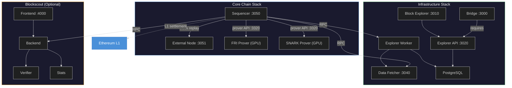

# Running an ADI Rollup with Docker Compose

This guide walks you through deploying a complete ADI Rollup stack using Docker Compose. The deployment is modular — start the core chain, then layer on infrastructure services as needed.

The stack is split into three compose files:

* **[Core Stack](core-stack.md)** — Sequencer, External Node, and GPU Provers (FRI + SNARK)
* **[Infrastructure Stack](infrastructure-stack.md)** — Block Explorer and Bridge
* **[Blockscout](blockscout.md)** — Optional alternative block explorer with contract verification



> **Warning:** The **Bridge requires the Block Explorer** to function. Blockscout is an additional explorer with contract verification support, but it cannot replace the Block Explorer for bridge operations.

---

## Prerequisites

### Hardware Requirements

| Component | CPU | RAM | GPU VRAM | Storage |
|-----------|-----|-----|----------|---------|
| Sequencer | 8+ cores | 16 GB+ | — | 100 GB SSD |
| External Node | 4+ cores | 8 GB+ | — | 100 GB SSD |
| FRI Prover | 4+ cores | 16 GB+ | 32 GB+ | 50 GB |
| SNARK Prover | 4+ cores | 32 GB+ | 32 GB+ | 50 GB |
| Infrastructure (Explorer + Bridge) | 2+ cores | 4 GB+ | — | 20 GB |

> **Note:** The entire stack (sequencer + provers) can run on a single machine with ~80 GB of system RAM. SNARK provers with less than 32 GB VRAM will fail with out-of-memory errors.

### Software Requirements

* **Docker Engine** 24.0+ with Compose V2
* **NVIDIA Container Toolkit** — required for GPU provers
* **NVIDIA drivers** with CUDA 12.2+ support
* A `genesis.json` configuration file for your chain
* An L1 RPC endpoint (e.g., ADI OS Testnet)

### Verify Docker and GPU Setup

```bash
# Docker
docker --version
docker compose version

# NVIDIA (on prover nodes)
nvidia-smi
docker run --rm --gpus all nvidia/cuda:12.2.0-base-ubuntu22.04 nvidia-smi
```

> **Tip:** If both commands return version information and the GPU test container runs successfully, your environment is ready.

---

## Directory Structure

Create the following layout on your server:

```
adi-rollup/
├── docker-compose.yml              # Core stack
├── docker-compose.infra.yml        # Infrastructure stack
├── docker-compose.blockscout.yml   # Optional Blockscout
├── .env                            # Environment variables
├── genesis.json                    # Chain genesis configuration
└── volumes/                        # Persistent data (auto-created)
    ├── chain/                      # Sequencer state
    ├── en_chain/                   # External Node state
    ├── shared/                     # Shared prover artifacts
    └── prover/                     # Prover output
```

```bash
mkdir -p adi-rollup && cd adi-rollup
mkdir -p volumes/{chain,en_chain,shared,prover}
```
## Save `genesis.json`

Place your chain’s `genesis.json` file in the project root so the compose files can mount it into the server containers:

```bash
# From your chain configs
cp /path/to/your/chain/configs/genesis.json ./genesis.json
```

---

## Environment Configuration

Create a `.env` file with your chain parameters. All compose files read from this shared configuration.

```bash
cat > .env << 'EOF'
# ── Chain Identity ──────────────────────────────────
CHAIN_NAME="My ADI Rollup"
CHAIN_SHORT_NAME=myrollup
CHAIN_ID=444
CHAIN_CURRENCY_SYMBOL=ADI
CHAIN_CURRENCY_NAME="ADI Token"

# ── L1 Connection ──────────────────────────────────
L1_RPC_URL=https://rpc.ab.testnet.adifoundation.ai

# ── Contract Addresses (from chain deployment) ─────
BRIDGEHUB_ADDRESS=0x274e31b8fc1ef5de0de9efcefa1b7097c1cc4560
BYTECODE_SUPPLIER_ADDRESS=0xa21084dd19e51ab1fdbd21fab4fcc2f73eb3cea0
DIAMOND_PROXY_ADDRESS=0xfea43989ac9cc0163eab599e1fccd47c478641ed

# ── L1 Operator Keys ──────────────────────────────
OPERATOR_COMMIT_PK=0x<your-commit-private-key>
OPERATOR_PROVE_PK=0x<your-prove-private-key>
OPERATOR_EXECUTE_PK=0x<your-execute-private-key>

# ── Image Versions ─────────────────────────────────
SERVER_IMAGE=harbor.sde.adifoundation.ai/adi-public/chain/server:v0.13.0-b1
PROVER_FRI_IMAGE=ghcr.io/matter-labs/zksync-os-prover-fri:v0.7.0
PROVER_SNARK_IMAGE=ghcr.io/matter-labs/zksync-os-prover-snark:v0.7.0
EXPLORER_APP_IMAGE=harbor.sde.adifoundation.ai/adi-public/chain/explorer/app:v1.0.0
EXPLORER_API_IMAGE=harbor.sde.adifoundation.ai/adi-public/chain/explorer/api:v1.0.0
EXPLORER_WORKER_IMAGE=harbor.sde.adifoundation.ai/adi-public/chain/explorer/worker:v1.0.0
EXPLORER_DATA_FETCHER_IMAGE=harbor.sde.adifoundation.ai/adi-public/chain/explorer/data-fetcher:v1.0.0
BRIDGE_IMAGE=harbor.sde.adifoundation.ai/adi-public/chain/bridge:v1.0.0

# ── GPU Devices ────────────────────────────────────
# Run `nvidia-smi -L` to list GPU or MIG instance UUIDs
GPU_DEVICE_FRI=GPU-xxxxxxxx-xxxx-xxxx-xxxx-xxxxxxxxxxxx
GPU_DEVICE_SNARK=GPU-yyyyyyyy-yyyy-yyyy-yyyy-yyyyyyyyyyyy

# ── Blockscout (optional) ──────────────────────────
SECRET_KEY_BASE=<generate-with: openssl rand -hex 32>
BLOCKSCOUT_DB_PASSWORD=<strong-password>
EOF
```

> **Warning:** Never commit `.env` to version control. It contains private keys and secrets. Use dedicated operator wallets — never use keys holding significant funds.


---

## Next Steps

Once your `.env` is configured, proceed to deploy each stack:

1. [Core Stack](core-stack.md) — Sequencer, External Node, and GPU Provers
2. [Infrastructure Stack](infrastructure-stack.md) — Block Explorer and Bridge
3. [Blockscout Explorer](blockscout.md) — Optional, for contract verification
4. [Operations](operations.md) — Running, monitoring, GPU configuration, and troubleshooting
5. [Configuration Reference](configuration-reference.md) — Full list of environment variables
