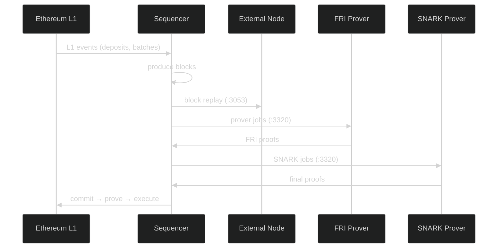

# Core Stack

The core stack runs the **Sequencer** (block production), **External Node** (read replica), and **GPU Provers** (ZK proof generation).



---

## Docker Compose

Create `docker-compose.yml`:

```yaml
services:
  # ─────────────────────────────────────────────
  # Sequencer — produces blocks and batches
  # ─────────────────────────────────────────────
  server:
    image: ${SERVER_IMAGE}
    container_name: ${CHAIN_SHORT_NAME}-sequencer
    restart: unless-stopped
    network_mode: host
    working_dir: /app
    environment:
      # Fee overrides
      fee_base_fee_override: "0x3e8"
      fee_pubdata_price_override: "0x1"
      fee_native_price_override: "0x1"
      sequencer_block_dump_path: "/chain/db/block_dumps"

      # Price oracle
      external_price_api_client_source: "Forced"
      external_price_api_client_forced_prices__json: '{"0x0000000000000000000000000000000000000000": 1.0}'

      # P2P network
      network_enabled: "true"
      network_secret_key: "${SEQUENCER_NETWORK_KEY}"
      network_port: "3060"

      # Storage
      general_rocks_db_path: "/chain/db/node1"

      # L1 connection
      general_l1_rpc_url: "${L1_RPC_URL}"

      # Genesis
      genesis_bridgehub_address: "${BRIDGEHUB_ADDRESS}"
      genesis_bytecode_supplier_address: "${BYTECODE_SUPPLIER_ADDRESS}"
      genesis_genesis_input_path: "/genesis/genesis.json"
      genesis_chain_id: ${CHAIN_ID}

      # L1 gas
      l1_sender_max_fee_per_blob_gas: 1000

      # Prover API
      prover_api_proof_storage_path: "/shared"
      prover_api_enabled: "true"
      prover_api_fake_fri_provers_enabled: "false"
      prover_api_fake_snark_provers_enabled: "false"
      prover_api_address: "0.0.0.0:3320"
      prover_input_generator_app_bin_unpack_path: "/chain/db/app_bins"
      prover_input_generator_maximum_in_flight_blocks: 120
      prover_api_fri_job_timeout: "1200s"
      prover_api_snark_job_timeout: "1200s"

      # Batching
      batcher_batch_timeout: "60s"
      batcher_blocks_per_batch_limit: 1400
      sequencer_max_transactions_in_block: 3000

      # L1 operator keys
      l1_sender_operator_commit_pk: ${OPERATOR_COMMIT_PK}
      l1_sender_operator_prove_pk: ${OPERATOR_PROVE_PK}
      l1_sender_operator_execute_pk: ${OPERATOR_EXECUTE_PK}
      l1_sender_max_fee_per_gas: 1000
      l1_sender_max_priority_fee_per_gas: 1000
      l1_sender_fusaka_upgrade_timestamp: 0
      l1_sender_pubdata_mode: "Calldata"

      RUST_LOG: "info"
    volumes:
      - ./volumes/chain:/chain
      - ./volumes/shared:/shared
      - ./genesis.json:/genesis/genesis.json:ro

  # ─────────────────────────────────────────────
  # External Node — syncs from sequencer
  # ─────────────────────────────────────────────
  external-node:
    image: ${EN_IMAGE}
    container_name: ${CHAIN_SHORT_NAME}-external-node
    restart: unless-stopped
    network_mode: host
    working_dir: /app
    depends_on: [server]
    environment:
      # EN mode
      general_node_role: "external"
      general_main_node_rpc_url: "http://127.0.0.1:3050"

      # EN network ports (avoid conflicts with sequencer)
      rpc_address: "0.0.0.0:3051"
      status_server_address: "0.0.0.0:3072"
      observability_prometheus_port: "3316"
      private_api_address: "127.0.0.1:8547"

      # P2P
      network_enabled: "true"
      network_secret_key: "${EN_NETWORK_KEY}"
      network_address: "127.0.0.1"
      network_port: "3061"
      network_boot_nodes: "${SEQUENCER_ENODE}"

      # Fee overrides (must match sequencer)
      fee_base_fee_override: "0x3E8"
      fee_pubdata_price_override: "0x1"
      fee_native_price_override: "0x1"

      # Storage
      general_rocks_db_path: "/chain/db/node1"
      sequencer_block_dump_path: "/chain/db/block_dumps"

      # L1 / Genesis
      general_l1_rpc_url: "${L1_RPC_URL}"
      genesis_bridgehub_address: "${BRIDGEHUB_ADDRESS}"
      genesis_bytecode_supplier_address: "${BYTECODE_SUPPLIER_ADDRESS}"
      genesis_genesis_input_path: "/genesis/genesis.json"
      genesis_chain_id: ${CHAIN_ID}

      RUST_LOG: "info"
    volumes:
      - ./volumes/en_chain:/chain
      - ./volumes/shared:/shared
      - ./genesis.json:/genesis/genesis.json:ro

  # ─────────────────────────────────────────────
  # FRI Prover — generates FRI proofs (GPU)
  # ─────────────────────────────────────────────
  fri-prover:
    image: ${PROVER_FRI_IMAGE}
    container_name: ${CHAIN_SHORT_NAME}-fri-prover
    restart: unless-stopped
    network_mode: host
    depends_on: [server]
    environment:
      RUST_LOG: "info"
    volumes:
      - ./volumes/prover:/prover
    command:
      - "--base-url"
      - "http://127.0.0.1:3320"
      - "--app-bin-path"
      - "/multiblock_batch.bin"
      - "--enabled-logging"
      - "--prover-name"
      - "fri-prover-1"
      - "--prometheus-port"
      - "3124"
    deploy:
      resources:
        reservations:
          devices:
            - driver: nvidia
              device_ids: ["${GPU_DEVICE_FRI}"]
              capabilities: [gpu]

  # ─────────────────────────────────────────────
  # SNARK Prover — generates final SNARK proofs (GPU)
  # ─────────────────────────────────────────────
  snark-prover:
    image: ${PROVER_SNARK_IMAGE}
    container_name: ${CHAIN_SHORT_NAME}-snark-prover
    restart: unless-stopped
    network_mode: host
    depends_on: [server]
    environment:
      RUST_MIN_STACK: "267108864"
    volumes:
      - ./volumes/prover:/prover
    command:
      - "run-prover"
      - "--sequencer-url"
      - "http://127.0.0.1:3320"
      - "--binary-path"
      - "/multiblock_batch.bin"
      - "--trusted-setup-file"
      - "/setup_compact.key"
      - "--output-dir"
      - "/prover"
      - "--prover-name"
      - "snark-prover-1"
      - "--prometheus-port"
      - "3126"
    deploy:
      resources:
        reservations:
          devices:
            - driver: nvidia
              device_ids: ["${GPU_DEVICE_SNARK}"]
              capabilities: [gpu]
```

---

## Start

```bash
docker compose up -d
```

## Verify

```bash
# Check all containers are running
docker compose ps

# Follow sequencer logs
docker compose logs -f server

# Test the RPC endpoint
curl -s -X POST http://localhost:3050 \
  -H "Content-Type: application/json" \
  -d '{"jsonrpc":"2.0","method":"eth_chainId","params":[],"id":1}'
```

> **Tip:** A successful response returns your chain ID in hex (e.g., `0x1bc` for chain ID 444). The External Node RPC is available at `http://localhost:3051`.
