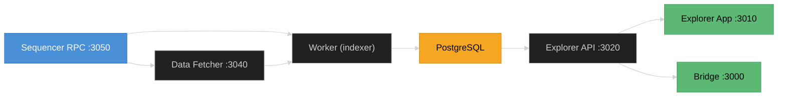

# Infrastructure Stack

The infrastructure stack provides the **Block Explorer** and the **Bridge**. The Bridge depends on the Block Explorer API to display transaction history and block data, so both must run together.



---

## Docker Compose

Create `docker-compose.infra.yml`:

```yaml
services:
  # ─────────────────────────────────────────────
  # PostgreSQL — explorer database
  # ─────────────────────────────────────────────
  postgres:
    image: postgres:14
    container_name: ${CHAIN_SHORT_NAME}-explorer-db
    restart: unless-stopped
    volumes:
      - explorer_db_data:/var/lib/postgresql/data
    healthcheck:
      test: ["CMD-SHELL", "pg_isready -U postgres"]
      interval: 5s
      timeout: 5s
      retries: 5
    environment:
      POSTGRES_USER: postgres
      POSTGRES_PASSWORD: postgres
      POSTGRES_DB: block-explorer

  # ─────────────────────────────────────────────
  # Explorer — Data Fetcher
  # ─────────────────────────────────────────────
  explorer-data-fetcher:
    image: ${EXPLORER_DATA_FETCHER_IMAGE}
    container_name: ${CHAIN_SHORT_NAME}-explorer-data-fetcher
    restart: unless-stopped
    ports:
      - "3040:3040"
    environment:
      PORT: 3040
      LOG_LEVEL: verbose
      BLOCKCHAIN_RPC_URL: http://host.docker.internal:3050
      RPC_BATCH_MAX_COUNT: 50
      RPC_CALLS_CONNECTION_QUICK_TIMEOUT: 30000
    extra_hosts:
      - "host.docker.internal:host-gateway"

  # ─────────────────────────────────────────────
  # Explorer — Worker (blockchain indexer)
  # ─────────────────────────────────────────────
  explorer-worker:
    image: ${EXPLORER_WORKER_IMAGE}
    container_name: ${CHAIN_SHORT_NAME}-explorer-worker
    restart: unless-stopped
    ports:
      - "3001:3001"
    environment:
      PORT: 3001
      LOG_LEVEL: verbose
      DATABASE_HOST: postgres
      DATABASE_USER: postgres
      DATABASE_PASSWORD: postgres
      DATABASE_NAME: block-explorer
      BLOCKCHAIN_RPC_URL: http://host.docker.internal:3050
      DATA_FETCHER_URL: http://explorer-data-fetcher:3040
      BASE_TOKEN_SYMBOL: ${CHAIN_CURRENCY_SYMBOL:-ADI}
      BASE_TOKEN_NAME: ${CHAIN_CURRENCY_NAME:-ADI Token}
      BASE_TOKEN_ICON_URL: /images/icons/adi-logo.svg
      SETTLEMENT_RPC_URL: ${L1_RPC_URL:-https://rpc.ab.testnet.adifoundation.ai}
      DIAMOND_PROXY_ADDRESS: ${DIAMOND_PROXY_ADDRESS}
      SETTLEMENT_BATCH_INDEXER_POLLING_INTERVAL: 10000
    extra_hosts:
      - "host.docker.internal:host-gateway"
    depends_on:
      postgres:
        condition: service_healthy

  # ─────────────────────────────────────────────
  # Explorer — API
  # ─────────────────────────────────────────────
  explorer-api:
    image: ${EXPLORER_API_IMAGE}
    container_name: ${CHAIN_SHORT_NAME}-explorer-api
    restart: unless-stopped
    ports:
      - "3020:3020"
    environment:
      PORT: 3020
      LOG_LEVEL: verbose
      DATABASE_HOST: postgres
      DATABASE_USER: postgres
      DATABASE_PASSWORD: postgres
      DATABASE_NAME: block-explorer
      BASE_TOKEN_SYMBOL: ${CHAIN_CURRENCY_SYMBOL:-ADI}
      BASE_TOKEN_NAME: ${CHAIN_CURRENCY_NAME:-ADI Token}
      BASE_TOKEN_L1_ADDRESS: "0x000000000000000000000000000000000000800A"
      BASE_TOKEN_ICON_URL: /images/icons/adi-logo.svg
    depends_on:
      - explorer-worker

  # ─────────────────────────────────────────────
  # Explorer — App (frontend)
  # ─────────────────────────────────────────────
  explorer-app:
    image: ${EXPLORER_APP_IMAGE}
    container_name: ${CHAIN_SHORT_NAME}-explorer-app
    restart: unless-stopped
    ports:
      - "3010:3010"
    environment:
      VITE_BRAND_NAME: ADI
      APP_NETWORK_NAME: "${CHAIN_NAME:-ADI Chain}"
      APP_L2_CHAIN_ID: ${CHAIN_ID:-444}
      APP_RPC_URL: http://localhost:3050
      APP_API_URL: http://localhost:3020
      APP_BASE_TOKEN_ADDRESS: "0x000000000000000000000000000000000000800A"
      APP_L1_EXPLORER_URL: https://explorer.ab.testnet.adifoundation.ai
      APP_BRIDGE_URL: http://localhost:3000
      APP_SETTLEMENT_CHAIN_NAME: "ADI Testnet"
      APP_SETTLEMENT_CHAIN_ID: 99999
    extra_hosts:
      - "host.docker.internal:host-gateway"
    depends_on:
      - explorer-api

  # ─────────────────────────────────────────────
  # Bridge (dApp Portal)
  # ─────────────────────────────────────────────
  bridge:
    image: ${BRIDGE_IMAGE}
    container_name: ${CHAIN_SHORT_NAME}-bridge
    restart: unless-stopped
    ports:
      - "3000:3000"
    extra_hosts:
      - "host.docker.internal:host-gateway"
    environment:
      RUNTIME_CONFIG: >
        {
          "nodeType": "hyperchain",
          "hyperchainsConfig": [
            {
              "network": {
                "id": ${CHAIN_ID:-444},
                "name": "${CHAIN_NAME:-ADI Chain}",
                "key": "${CHAIN_SHORT_NAME:-myrollup}",
                "rpcUrl": "http://localhost:3050/",
                "blockExplorerUrl": "http://localhost:3010/",
                "blockExplorerApi": "http://localhost:3020",
                "l1BlockExplorerApi": "https://explorer-api.ab.testnet.adifoundation.ai",
                "nativeTokenBridgingOnly": false,
                "nativeCurrency": {
                  "name": "${CHAIN_CURRENCY_NAME:-ADI Token}",
                  "symbol": "${CHAIN_CURRENCY_SYMBOL:-ADI}",
                  "decimals": 18
                },
                "l1Network": {
                  "id": 99999,
                  "name": "ADI OS Testnet",
                  "network": "adi_testnet",
                  "nativeCurrency": {
                    "name": "ADI Token",
                    "symbol": "ADI",
                    "decimals": 18
                  },
                  "rpcUrls": {
                    "default": {
                      "http": ["${L1_RPC_URL:-https://rpc.ab.testnet.adifoundation.ai}"]
                    },
                    "public": {
                      "http": ["${L1_RPC_URL:-https://rpc.ab.testnet.adifoundation.ai}"]
                    }
                  }
                }
              },
              "tokens": [
                {
                  "address": "0x000000000000000000000000000000000000800A",
                  "l1Address": "0x0000000000000000000000000000000000000000",
                  "symbol": "${CHAIN_CURRENCY_SYMBOL:-ADI}",
                  "name": "${CHAIN_CURRENCY_NAME:-ADI Token}",
                  "decimals": 18,
                  "iconUrl": "/img/adi.svg"
                }
              ]
            }
          ]
        }

volumes:
  explorer_db_data:
    name: ${CHAIN_SHORT_NAME:-myrollup}_explorer_db_data
```

---

## Start

```bash
docker compose -f docker-compose.infra.yml up -d
```

## Verify

| Service | URL | What to Expect |
|---------|-----|----------------|
| Block Explorer | `http://localhost:3010` | Block explorer UI — blocks, transactions, accounts |
| Explorer API | `http://localhost:3020` | REST API for blockchain data |
| Bridge | `http://localhost:3000` | Deposit and withdrawal interface |

> **Warning:** The Bridge will not display any network data until the Block Explorer worker has indexed at least a few blocks. Allow a minute for the initial sync to complete.
