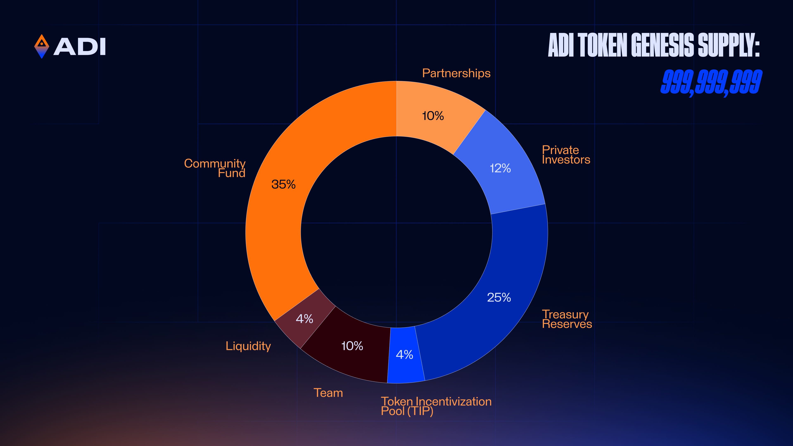

# ADI Tokenomics Overview

Genesis supply: 999,999,999

<figure><figcaption></figcaption></figure>

#### Allocation

| Category              | Alloc. % |          Tokens | Cliff  | Vest    | % Bullet at Cliff | Vested at TGE, % | Circulating at TGE % |      TGE Circ. |
| --------------------- | -------: | --------------: | ------ | ------- | ----------------: | ---------------: | -------------------: | -------------: |
| Team                  |      10% |   99,999,999.90 | 12 mo. | 72 mo.  |            0.000% |           0.000% |               0.000% |              — |
| Private Investors     |      12% |  119,999,999.88 | 12 mo. | 72 mo.  |            0.000% |           0.000% |               0.000% |              — |
| Treasury Reserves     |      25% |  249,999,999.75 | None   | 108 mo. |            5.000% |           1.250% |               0.625% |   6,249,999.99 |
| Token Incentivization |       4% |   39,999,999.96 | None   | Immed.  |          100.000% |           4.000% |               1.000% |   9,999,999.99 |
| Partnerships          |      10% |   99,999,999.90 | 12 mo. | 72 mo.  |            0.000% |           0.000% |               0.000% |              — |
| Liquidity             |       4% |   39,999,999.96 | None   | Immed.  |          100.000% |           4.000% |               4.000% |  39,999,999.96 |
| Community Fund        |      35% |  349,999,999.65 | None   | 72 mo.  |            1.370% |           0.480% |               0.240% |   2,397,260.27 |
| **TOTAL**             | **100%** | **999,999,999** |        |         |                   |                  |           **5.865%** | **58,647,260** |

\
Note: During the first year, tokens unlock monthly on the 9th of each month.
