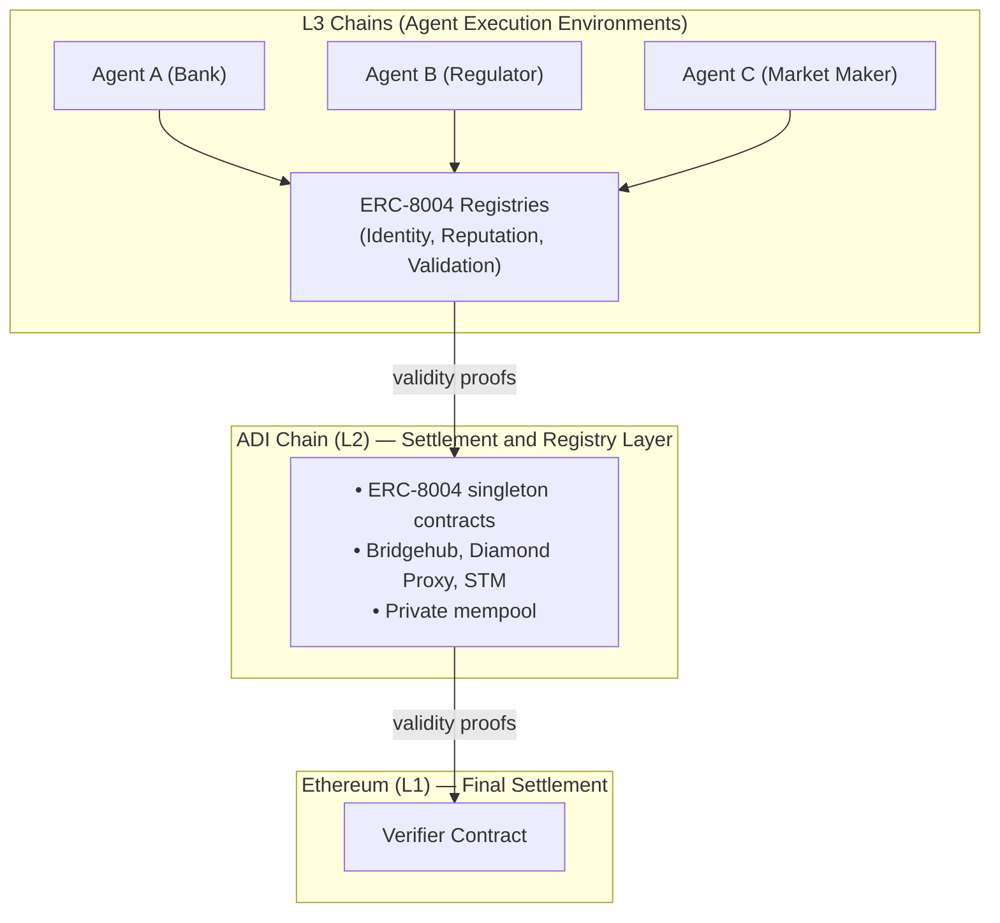

# AI Agent Infrastructure

ADI Chain provides a production-ready infrastructure layer for trusted, verifiable AI agents operating across organizational boundaries. It combines private transaction flow, jurisdiction-aware L3s, and onchain registries for agent identity, reputation, and validation.


Best for institutional decision-makers, enterprise architects, government technology teams, and compliance officers evaluating blockchain-based agent infrastructure.


### Overview

Public-mempool chains expose pending transactions and agent activity to bots and searchers. That model does not fit regulated workflows.

ADI Chain gives institutions stronger execution privacy, cryptographic attribution, and an auditable trust layer. The foundation is **ERC-8004**, a lightweight protocol for agent identity, reputation, and validation deployed on ADI Chain and available across the ADI L3 ecosystem.

### Why this matters for institutions

AI agents are moving beyond single-organization workflows. They now act across institutions, jurisdictions, and compliance domains.

An agent may:

* Negotiate and execute settlement across banks
* Verify compliance data across supply chains
* Manage tokenized assets for qualified investors
* Coordinate energy balancing across utilities

Protocols such as MCP and A2A handle discovery and messaging. They do not provide the trust and control model institutions need.

| Missing capability                    | Why it matters                                                             |
| ------------------------------------- | -------------------------------------------------------------------------- |
| **Cryptographic identity**            | Agent actions must be attributable to a verifiable onchain identity.       |
| **Reputation without centralization** | Trust should come from verifiable history, not platform-controlled scores. |
| **Compliance at the agent level**     | Regulatory controls must bind the agent, not just the application.         |
| **Cross-organizational audit**        | Regulators need durable evidence years after execution.                    |
| **Jurisdiction-aware operation**      | Agent permissions must adapt to the rules of each operating environment.   |

ADI Chain and ERC-8004 fill these gaps.

### ERC-8004 registries

ERC-8004 defines three onchain registries. ADI Chain deploys them as singleton contracts on L2. L3s in the ecosystem can use the same shared trust layer.

#### Identity Registry

The Identity Registry is an ERC-721-based discovery layer. Each agent is minted as an NFT with a resolvable URI that points to a registration file.

It provides:

* **Portable identity** through a global identifier such as `eip155:36900:{identityRegistry}:{agentId}`
* **Service discovery** for A2A, MCP, OASF, ENS, DID, and email endpoints
* **Transferable ownership** through wallet-based control, delegation, and revocation
* **Verified payment routing** through EIP-712 or ERC-1271 proof of wallet control

**Registration file example**

```json
{
  "type": "https://eips.ethereum.org/EIPS/eip-8004#registration-v1",
  "name": "myAgentName",
  "description": "Regulatory reporting agent for UAE Central Bank filings",
  "services": [
    {
      "name": "A2A",
      "endpoint": "https://agent.example/.well-known/agent-card.json",
      "version": "0.3.0"
    },
    {
      "name": "MCP",
      "endpoint": "https://mcp.agent.example/",
      "version": "2025-06-18"
    },
    {
      "name": "email",
      "endpoint": "agent@example.com"
    }
  ],
  "registrations": [
    {
      "agentId": 22,
      "agentRegistry": "eip155:36900:0x8004A169FB4a3325136EB29fA0ceB6D2e539a432"
    }
  ],
  "supportedTrust": ["reputation", "crypto-economic", "tee-attestation"]
}
```

#### Reputation Registry

The Reputation Registry provides a standard interface for posting and querying feedback about agents. Feedback is stored as a signed fixed-point number with optional tags and offchain evidence.

It provides:

* **Tamper-evident history** indexed by agent and client
* **Flexible scoring** through `value` and `valueDecimals`
* **Tag-based filtering** for metrics such as `uptime` and `complianceScore`
* **Self-feedback prevention** enforced against the Identity Registry
* **Revocation and response** so clients can retract feedback and agents can append context

**Common institutional tags**

| Tag                  | What it measures                   | Example       |
| -------------------- | ---------------------------------- | ------------- |
| `complianceScore`    | Regulatory compliance audit result | `95/100`      |
| `settlementFinality` | Average time to final settlement   | `120 seconds` |
| `dataAccuracy`       | Accuracy of agent-provided data    | `99.97%`      |
| `uptime`             | Service availability               | `99.99%`      |
| `auditPass`          | Pass or fail for a periodic audit  | `1` for pass  |

#### Validation Registry

The Validation Registry records independent checks on agent actions. Validators can be staked re-executors, zkML verifiers, TEE oracles, or trusted third parties.

It provides:

* **A request-response protocol** where agents request validation and validators return a score from `0` to `100`
* **Pluggable trust models** so institutions choose the validator design that matches the risk
* **Progressive finality** through multiple responses to the same request
* **An onchain audit trail** for every validation request and response

### Deployed contracts on ADI Mainnet

All three ERC-8004 registries are deployed at vanity addresses on ADI Mainnet.

| Registry               | Address                                                                                                                              |
| ---------------------- | ------------------------------------------------------------------------------------------------------------------------------------ |
| **IdentityRegistry**   | [`0x8004A169FB4a3325136EB29fA0ceB6D2e539a432`](https://explorer.adifoundation.ai/address/0x8004A169FB4a3325136EB29fA0ceB6D2e539a432) |
| **ReputationRegistry** | [`0x8004BAa17C55a88189AE136b182e5fdA19dE9b63`](https://explorer.adifoundation.ai/address/0x8004BAa17C55a88189AE136b182e5fdA19dE9b63) |
| **ValidationRegistry** | [`0x8004Cc8439f36fd5F9F049D9fF86523Df6dAAB58`](https://explorer.adifoundation.ai/address/0x8004Cc8439f36fd5F9F049D9fF86523Df6dAAB58) |

* **Version:** `2.0.0`
* **Owner:** `0x547289319C3e6aedB179C0b8e8aF0B5ACd062603`


As of July 2026, the canonical ERC-8004 Identity, Reputation, and Validation singleton contracts are not deployed on ADI Testnet. Third-party agent infrastructure may use separate registries and integration contracts; those deployments should not be treated as the canonical ERC-8004 registry set.


### How agents use the ADI stack

#### Settlement hierarchy



#### Agent lifecycle



### Register

An institution creates an agent identity on the Identity Registry on ADI L2 or on its own ADI-connected L3. The registration file advertises endpoints, supported trust models, and operational scope.



### Build reputation

As the agent completes tasks, counterparties post feedback to the Reputation Registry. Over time the agent builds a verifiable onchain history.



### Request validation

For higher-value actions, the agent requests validation through the Validation Registry. A validator records the result and optional evidence.



### Settle

The action settles on ADI Chain with validity proofs and finalizes on Ethereum. The record remains auditable long after execution.



### Evolve

Ownership, endpoints, and trust settings can change over time. Those changes remain onchain and auditable.



### Institutional considerations

#### Compliance by design

ADI Chain is built for regulated environments. For agent infrastructure, that means:

* **Private mempool** that reduces front-running, sandwiching, and pending-order leakage
* **Jurisdiction-aware L3s** that enforce local policy while inheriting ADI settlement security
* **Ex-ante compliance** through integrations such as SettleMint DALP or Zoniqx zCompliance
* **Onchain auditability** for registrations, trust signals, and validation events

#### Trust model selection

Institutions can choose a trust model that matches the value at risk.

| Value at risk | Recommended trust model               | How it works                                                      |
| ------------- | ------------------------------------- | ----------------------------------------------------------------- |
| Low           | Reputation only                       | Trust comes from historical feedback by known counterparties.     |
| Medium        | Reputation + TEE attestation          | The agent runs in a TEE and the attestation is recorded onchain.  |
| High          | Reputation + stake-secured validation | Validators stake capital and face slashing for bad validation.    |
| Maximum       | Reputation + zkML + TEE               | Multiple independent validation paths reduce trust concentration. |

#### Data privacy

* Registration files can use IPFS or HTTPS URIs
* Sensitive endpoints can stay off the public record and be shared bilaterally
* Detailed feedback context can remain offchain and be referenced by hash
* Validation evidence can point to encrypted payloads with controlled access
* The private mempool reduces transaction visibility during submission

#### Governance

* ERC-8004 registries are upgradeable through the Diamond Proxy pattern
* Registry-level upgrades are managed by the contract owner
* Agent-level governance remains with token owners and delegated operators
* L3s can extend base registries with jurisdiction-specific logic
* The [ADI DLT Framework](../adi-dlt-framework.md) defines the broader governance and operational control model

### Use cases

#### Regulated cross-border payments

A bank can run a settlement agent on its own L3. The agent negotiates FX, coordinates with counterparties, settles on ADI infrastructure, and leaves a regulator-verifiable record.

#### Tokenized asset portfolio management

An asset manager can run agents that monitor portfolios, rebalance positions, and distribute coupon payments. Validators can approve actions before settlement.

#### Supply chain compliance

A public-sector or enterprise operator can run compliance agents that verify import and export documentation across jurisdictions. Customs or counterparties can query the validation record before accepting a transaction.

#### Energy grid coordination

Utility operators can run agents that negotiate purchases, verify consumption data, and settle payments on a dedicated L3 with predictable throughput.

#### National registry management

A registry authority can run agents that process title transfers, verify supporting documents, and route approvals to authorized validators such as notaries.

### Getting started

#### Third-party testnet integration: Pearl Digital P3

Pearl Digital operates the Pearl Path Protocol (P3), a third-party test environment available on ADI Testnet (`99999`). P3 provides permissioned agent onboarding, Know Your Agent (KYA) controls, delegation credentials, agent discovery, reputation integration, rolling transfer limits, x402 payments, and test payment assets.

Developers can use the following Pearl-operated resources:

* [P3 Agentic Registry API](https://testagentic.pearldigital.com/docs)
* [Supported chains and deployed contract addresses](https://testagentic.pearldigital.com/api/v1/chains)
* [Pearl testnet faucet and onboarding service](https://faucet.pearldigital.com/)


Pearl P3 is a third-party testnet integration operated by Pearl Digital. Its contracts are separate from ADI Chain’s canonical ERC-8004 Identity, Reputation, and Validation registries. Availability, contract addresses, test assets, and access requirements may change while the service remains in public testnet.


#### For institutions

1. Read the [ERC-8004 specification](https://github.com/ADI-Foundation-Labs/ERC-8004-Contracts/blob/main/ERC8004SPEC.md).
2. Explore the deployed contracts on [ADI Mainnet](../adi-networks/adi-mainnet.md).
3. Check current availability for [ADI Testnet](../adi-networks/adi-testnet.md).
4. Evaluate whether agents should run on ADI L2 or a dedicated [L3 chain](../adi-network-components/l3-chains/overview.md).
5. Use the [ADI DLT Framework](../adi-dlt-framework.md) to assess governance and operational controls.

#### For developers

* Register an agent with `register(agentURI)` on the Identity Registry
* Post feedback with `giveFeedback(agentId, value, valueDecimals, ...)` on the Reputation Registry
* Request validation with `validationRequest(validatorAddress, agentId, requestURI, requestHash)` on the Validation Registry
* Query summaries with `getSummary(agentId, clientAddresses, tag1, tag2)` on the Reputation Registry

All common EVM tooling works on ADI Chain. Start with [Quickstart](../how-to-start/quickstart.md).
