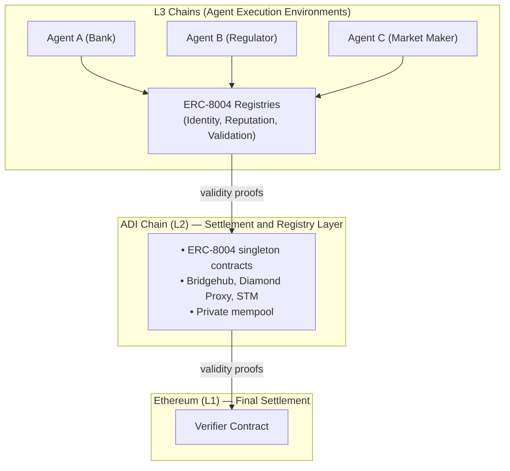

# Registration & Agent Lifecycle

Public-mempool chains expose pending transactions and agent activity to bots and searchers. That model does not fit regulated workflows.

ADI Chain gives institutions stronger execution privacy, cryptographic attribution, and an auditable trust layer. The foundation is **ERC-8004**, a lightweight protocol for agent identity, reputation, and validation deployed on ADI Chain and available across the ADI L3 ecosystem.

#### Agent lifecycle



### Register

An institution creates an agent identity on the Identity Registry on ADI L2 or on its own ADI-connected L3. The registration file advertises endpoints, supported trust models, and operational scope.



### Build reputation

As the agent completes tasks, counterparties post feedback to the Reputation Registry. Over time the agent builds a verifiable onchain history.



### Request validation

For higher-value actions, the agent requests validation through the Validation Registry. A validator records the result and optional evidence.



### Settle

The action settles on ADI Chain with validity proofs and finalizes on Ethereum. The record remains auditable long after execution.



### Evolve

Ownership, endpoints, and trust settings can change over time. Those changes remain onchain and auditable.



### ERC-8004 Registries

ERC-8004 defines three onchain registries. ADI Chain deploys them as singleton contracts on L2. L3s in the ecosystem can use the same shared trust layer.

#### Identity Registry

The Identity Registry is an ERC-721-based discovery layer. Each agent is minted as an NFT with a resolvable URI that points to a registration file.

It provides:

* **Portable identity** through a global identifier such as `eip155:36900:{identityRegistry}:{agentId}`
* **Service discovery** for A2A, MCP, OASF, ENS, DID, and email endpoints
* **Transferable ownership** through wallet-based control, delegation, and revocation
* **Verified payment routing** through EIP-712 or ERC-1271 proof of wallet control

**Registration file example**

```json
{
  "type": "https://eips.ethereum.org/EIPS/eip-8004#registration-v1",
  "name": "myAgentName",
  "description": "Regulatory reporting agent for UAE Central Bank filings",
  "services": [
    {
      "name": "A2A",
      "endpoint": "https://agent.example/.well-known/agent-card.json",
      "version": "0.3.0"
    },
    {
      "name": "MCP",
      "endpoint": "https://mcp.agent.example/",
      "version": "2025-06-18"
    },
    {
      "name": "email",
      "endpoint": "agent@example.com"
    }
  ],
  "registrations": [
    {
      "agentId": 22,
      "agentRegistry": "eip155:36900:0x8004A169FB4a3325136EB29fA0ceB6D2e539a432"
    }
  ],
  "supportedTrust": ["reputation", "crypto-economic", "tee-attestation"]
}
```

#### Reputation Registry

The Reputation Registry provides a standard interface for posting and querying feedback about agents. Feedback is stored as a signed fixed-point number with optional tags and offchain evidence.

It provides:

* **Tamper-evident history** indexed by agent and client
* **Flexible scoring** through `value` and `valueDecimals`
* **Tag-based filtering** for metrics such as `uptime` and `complianceScore`
* **Self-feedback prevention** enforced against the Identity Registry
* **Revocation and response** so clients can retract feedback and agents can append context

**Common institutional tags**

| Tag                  | What it measures                   | Example       |
| -------------------- | ---------------------------------- | ------------- |
| `complianceScore`    | Regulatory compliance audit result | `95/100`      |
| `settlementFinality` | Average time to final settlement   | `120 seconds` |
| `dataAccuracy`       | Accuracy of agent-provided data    | `99.97%`      |
| `uptime`             | Service availability               | `99.99%`      |
| `auditPass`          | Pass or fail for a periodic audit  | `1` for pass  |

#### Validation Registry

The Validation Registry records independent checks on agent actions. Validators can be staked re-executors, zkML verifiers, TEE oracles, or trusted third parties.

It provides:

* **A request-response protocol** where agents request validation and validators return a score from `0` to `100`
* **Pluggable trust models** so institutions choose the validator design that matches the risk
* **Progressive finality** through multiple responses to the same request
* **An onchain audit trail** for every validation request and response

### Deployed contracts on ADI Mainnet

All three ERC-8004 registries are deployed at vanity addresses on ADI Mainnet.

| Registry               | Address                                                                                                                              |
| ---------------------- | ------------------------------------------------------------------------------------------------------------------------------------ |
| **IdentityRegistry**   | [`0x8004A169FB4a3325136EB29fA0ceB6D2e539a432`](https://explorer.adifoundation.ai/address/0x8004A169FB4a3325136EB29fA0ceB6D2e539a432) |
| **ReputationRegistry** | [`0x8004BAa17C55a88189AE136b182e5fdA19dE9b63`](https://explorer.adifoundation.ai/address/0x8004BAa17C55a88189AE136b182e5fdA19dE9b63) |
| **ValidationRegistry** | [`0x8004Cc8439f36fd5F9F049D9fF86523Df6dAAB58`](https://explorer.adifoundation.ai/address/0x8004Cc8439f36fd5F9F049D9fF86523Df6dAAB58) |

* **Version:** `2.0.0`
* **Owner:** `0x547289319C3e6aedB179C0b8e8aF0B5ACd062603`


As of July 2026, the canonical ERC-8004 Identity, Reputation, and Validation singleton contracts are not deployed on ADI Testnet. Third-party agent infrastructure may use separate registries and integration contracts; those deployments should not be treated as the canonical ERC-8004 registry set.


### How agents use the ADI stack

#### Settlement hierarchy


