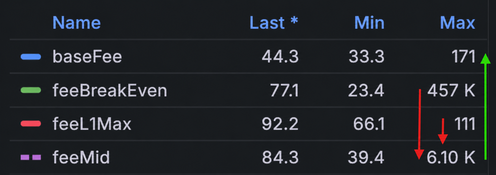
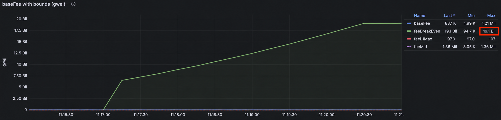

# Gas Model

ADI gas economics is built around a single goal: an L2 base fee that is **sane** for users,
**competitive** with L1, and **profitable** for the chain, all at the same time.

This page walks through the anchors and block-to-block dynamics that produce the [final `baseFee` formula](#final-basefee-formula).


**TL;DR:** The base fee is pulled by two forces:
1. a slow gravitational pull toward a profitability center `feeMid`,
2. an EIP-1559-style reaction to demand.


## L2 Economy

The price for a single L2 transaction is just:

$$
\text{txFee} = \text{L2 gas} \times \text{baseFee}
$$

ADI's approach is intentionally generic: each transaction's `gas × baseFee` is what stands against the chain's system
spending across a batch. There is no separate line item for L1 pubdata
(the bytes the transaction commits to the L1 state diff); pubdata cost is implicitly accounted for inside the gas.
*The entire economics lives in `baseFee`.*


**Profitability rule.** Across a sealed batch, the total L2 fees must cover the L1 sealing cost plus infrastructure spending.


$$
\text{batchCost}_{L1} + \text{infraCost} \;\leq\; \text{baseFee}_{L2} \cdot \sum_{i=1}^{N} \text{gas}_{L2,i}
$$

<figure>
  
  <figcaption><p>Each L2 transaction's <code>gas × baseFee</code> revenue, collected across a batch,
must cover the three L1 transactions (commit / approve / execute) that seal it.</p></figcaption>
</figure>

Two extremes follow from this inequality:

1. **Few transactions per batch.** The chain is non-profitable unless `baseFee` is set high.
2. **Many transactions per batch.** The chain is profitable even with a low `baseFee`.

Generally speaking, it doesn't matter exactly how the chain prices a unit of gas
as long as the price is reasonable (proportional to EVM ops, proving, verifying, and so on).

## Three Pricing Anchors

The base fee is shaped by three economic anchors. *None of them is a hard cap*,
and each is a **gravity point** that pulls the price with a different weight.

<figure>
  
  <figcaption><p>Live <code>baseFee</code> drifting between its three anchors over a measurement window.</p></figcaption>
</figure>

| Base fee anchors               | Definition                                    | Role / Weight       | Weight |
| ------------------------------ | --------------------------------------------- | ------------------- | :----: |
| `feeUsable` (Usability target) | Theoretical "sane" fee from typical use cases | Stable center       |  1/2   |
| `feeL1Max` (Soft MAX)          | L1 gas price converted to L2 scale            | Profitable ceiling  |  1/3   |
| `feeBreakEven` (Soft MIN)      | L2 break-even fee (noisiest metric)           | Profitability floor |  1/6   |

In normal conditions, we'd expect:

$$
\text{feeBreakEven} \;\leq\; \text{baseFee}_{L2} \;\leq\; \text{feeUsable} \;\leq\; \text{feeL1Max}
$$

In practice, the break-even price can exceed the L1-derived cap (`min > max`), for example, during low-activity windows
when there aren't enough transactions to cover the chain's expenses. This is why the anchors are **gravity points**,
not hard limits, and why the formula gravitates toward a geometric mean rather than clipping.

### `feeUsable`: theoretical sane fee


**Definition.** The usability target is the gas price that makes typical transactions cost
what we think a user should pay (about $0.004 for a native transfer, $0.012 for an ERC-20 transfer, and so on).


We curate a basket of 16 representative on-chain operations, each tagged with a typical gas cost
and a target USD cost the user should pay for it. For each operation, we solve for the gas price
that hits its target, then take a weighted average across the basket:

$$
\text{price}_i = \frac{\text{targetCost}_i}{\text{gasUsed}_i \cdot \text{adiUsdPrice}}
$$

$$
\text{feeUsable} = \sum_{i=1}^{n} \frac{\text{price}_i \cdot \text{weight}_i}{n}
$$

The example of a basket in the operator config:



| Operation            |    Gas | Target cost (USD) | Weight |
| -------------------- | -----: | ----------------: | :----: |
| `native_transfer`    | 21,000 |             0.004 |   1    |
| `erc20_approve`      | 45,000 |             0.008 |   1    |
| `erc20_transferFrom` | 65,000 |             0.012 |   1    |



```typescript
export const DEFAULT_BASEMAX_OPERATIONS: BaseMaxOperation[] = [
  { operationType: "native_transfer",         gasUsed:  21_000, targetCostUsd: 0.004, weight: 1 },
  { operationType: "erc20_approve",           gasUsed:  45_000, targetCostUsd: 0.008, weight: 1 },
  { operationType: "erc20_transferFrom",      gasUsed:  65_000, targetCostUsd: 0.012, weight: 1 },
];
```



This is the most stable input to `feeMid` and therefore carries the largest weight.

### `feeL1Max`: soft maximum


**Definition.** The soft maximum is the L1 chain's gas price converted to L2 scale.


$$
\text{feeL1Max} = \frac{\text{L1 gas price}}{\text{adiEthRatio}}
$$

The idea is that the L2 chain is NOT generally be considered attractive
if its gas price is higher than the L1 gas price.

`feeL1Max` is therefore a "good high value" that we don't want the base fee to drift far above.

### `feeBreakEven`: soft minimum (profit floor)


**Definition.** The break-even fee is the L2 gas price at which the network stops operating at a loss.


We want L2 revenue to cover L1 expenses:

1. L2 revenue ≥ L1 expenses
2. `baseFee` ≥ L1 expenses ÷ L2 gas

$$
\text{feeBreakEven}_{L2} \;\geq\; \frac{\text{batchGas}_{L1} \cdot \text{gasPrice}_{L1} + \text{infraCost}_{batch}}{N \cdot \bar{g}}
$$

where `N` is the average number of L2 transactions in a sealed batch and `g` is the average gas per L2 transaction. The infrastructure cost is amortized per batch:

$$
\text{infraCost}_{batch} = \frac{\text{infraCost}_{year} \cdot \text{avgBatchTime}_{sec} \cdot 10^{18}_{wei}}{31{,}536{,}000_{sec} \cdot \text{ethPriceUsd}}
$$

`feeBreakEven` is a useful starting point but has well-known rough edges:


**Corner cases.**

1. `feeBreakEven` can be much **lower** than `feeL1Max` (low cost, low load).
2. `feeBreakEven` can **exceed** `feeL1Max` (`min > max`).
3. `feeBreakEven` can **change sharply** between measurement windows.
4. **Cold start.** With near-zero TPS, `feeBreakEven` can blow up to billions of gwei.


## `feeMid`: the profitability center

`feeMid` is the global gravity point. The base fee is pulled toward it over time.
We define it as a geometric mean of the three anchors, weighted to reflect their stability and importance:

$$
\boxed{\;\text{feeMid}_{L2} = \text{feeBreakEven}^{1/6} \cdot \text{feeL1Max}^{1/3} \cdot \text{feeUsable}^{1/2}\;}
$$

The exponents sum to 1 (1/6 + 1/3 + 1/2), giving:

* `feeUsable` ≈ 50% of the weight, stabilizing the price around a "sane" point.
* `feeL1Max` ≈ 33% of the weight, pulling toward a profitable, L1-aligned value.
* `feeBreakEven` ≈ 17% of the weight. Smallest because it is the noisiest input.
  Its job is to softly pull the price toward break-even when economics demand it, without overpowering the more stable anchors.



We start from a plain geometric mean of three components, but use a **cold-start-adjusted** break-even
instead of the raw value:

$$
\text{feeMid}_{L2} = \sqrt[3]{\text{feeBreakEvenAdjusted} \cdot \text{feeL1Max} \cdot \text{feeUsable}}
$$

The adjustment scales `feeBreakEven` toward `feeUsable` to dampen cold-start spikes (see [Cold Start](#cold-start)):

$$
\text{feeBreakEvenAdjusted}_{L2} = \sqrt{\text{feeBreakEven} \cdot \text{feeUsable}}
$$

Substituting:

$$
\text{feeMid}_{L2} = \sqrt[3]{\sqrt{\text{feeBreakEven} \cdot \text{feeUsable}} \cdot \text{feeL1Max} \cdot \text{feeUsable}}
$$

Distributing exponents collapses to the boxed form above with weights 1/6, 1/3, 1/2.



<figure><figcaption><p>Last / Min / Max for the live <code>baseFee</code> and the three anchor series.</p></figcaption></figure>

## Cold Start

<figure><figcaption><p>With near-zero TPS, raw <code>feeBreakEven</code> grows without bound.</p></figcaption></figure>

At cold start `feeBreakEven` can reach 20,000,000,000 gwei or more.
Feeding that directly into the geometric mean overwhelms the other anchors. We manage it by mixing it
with `feeUsable` before it enters `feeMid`:

$$
\text{feeBreakEvenAdjusted}_{L2} = \sqrt{\text{feeBreakEven} \cdot \text{feeUsable}}
$$

The square root with a stable companion compresses extreme values into a workable range, and the further reduction
to a 1/6 weight inside `feeMid` finishes the job.

## Why No Hard Caps

We deliberately avoid `if-else` branches around the corner cases. Instead, the price gravitates slowly toward `feeMid`,
which behaves well in every extreme:

* **Sudden drops** to a low break-even don't crash the price (lost revenue).
* **Sudden spikes** in break-even don't slam the price into the ceiling.
* The geometric average can't drag the price into a permanent loss zone, because `feeUsable` and `feeL1Max` keep pulling.

The `min > max` case is essentially a low-TPS edge case. We want to raise the base fee,
but not so much that we destroy user economics. Gravitating toward `mid = ∛(min · max · usable)`
strikes that balance and removes the need for explicit branches.

## Two-Spring Dynamics

The base fee evolves under two opposing springs acting on a single mass:

* **Spring 1: demand** (EIP-1559).
  * If blocks are getting full → price should rise.
  * If blocks are empty → price should fall.
* **Spring 2: gravity** toward the **profitability center** (`feeMid`).

The base fee itself is the mass:

$$
\text{baseFee}_{t+1} = \text{baseFee}_t \cdot \bigl(1 + k \cdot k_g \cdot (\text{util} - 1)\bigr) + g \cdot (\text{feeMid} - \text{baseFee}_t)
$$

where:

* `k` is the demand reaction strength.
* `g` is the gravity strength toward `feeMid`.
* `util - 1` lies in `[-1, 1]` and reflects block utilization: more transactions in a L2 block bump the gas price.
* `g · (feeMid - baseFee)` is the absolute pull toward the profitability center:
  even with empty blocks, the price climbs back if it's too low.

A pure EIP-1559 difference `(gasUsed/gasTarget - 1)` isn't sufficient by itself: persistent L2 underutilization
*would drive the price to zero*. We correct the demand term `k` whenever the fee is far from `feeMid`
so that gravity can take over:


We want the demand/utilization term `k·(util - 1)` to get weaker when the fee is far below profitability center
`feeMid`, thus making the `g` term to get the price back: the `k_g ∈ (0; 1]` carries out this function.


The gravity correction factor `k_g ∈ (0, 1]` is symmetric around `baseFee/feeMid`: it shrinks both when the fee
is far above the center and when it's far below.

$$
k_g = \min\!\left(\frac{\text{baseFee}}{\text{feeMid}}, \; \frac{\text{feeMid}}{\text{baseFee}}\right)^{p=1|2}
$$

Now, just let’s substitute the `k_g` and `util` terms in the `baseFee` equation:

$$
k_g \cdot (\text{util} - 1) = \min\!\left(\frac{\text{baseFee}}{\text{feeMid}}, \; \frac{\text{feeMid}}{\text{baseFee}}\right)^{p=1|2} \cdot \left(\frac{\text{gasUsed}}{\text{gasTarget}} - 1\right)
$$

## Final `baseFee` Formula

Combining gravity, corrected demand, and the geometric center:



$$
\begin{aligned}
\text{baseFee}_{t+1} \;=\; & \text{baseFee}_t \cdot \left(1 + k \cdot \min\!\left(\frac{\text{baseFee}}{\text{feeMid}}, \frac{\text{feeMid}}{\text{baseFee}}\right)^{p=1|2} \cdot \left(\frac{\text{gasUsed}}{\text{gasTarget}} - 1\right)\right) \\
& + \; g \cdot (\text{feeMid} - \text{baseFee}_t)
\end{aligned}
$$



```text
baseFee_next = baseFee
             * (1 + k * min(baseFee/feeMid, feeMid/baseFee)^p
                      * (gasUsed/gasTarget - 1))
             + g * (feeMid - baseFee)
```



| Symbol        | Meaning                                                          | Value |
| ------------- | ---------------------------------------------------------------- | ----- |
| `baseFee_t`   | Current L2 base fee                                              | live  |
| `baseFee_t+1` | Next-step base fee                                               | live  |
| `feeMid`      | Profitability target (geometric mean)                            | live  |
| `gasUsed`     | Average L2 gas used per measurement period (~1 min)              | live  |
| `gasTarget`   | Target L2 gas per measurement period                             | 1M    |
| `k`           | Demand reaction strength                                         | ≈ 0.1 |
| `g`           | Gravity strength toward `feeMid`                                 | ≈ 0.1 |
| `p`           | Exponent (1 or 2) controlling how fast demand weakens off-center | 1     |



### Guard Cap: ±10% Per Step

To prevent any single update from moving the fee too far in one step,
the result is clipped to ±10% of the previous value:

$$
\text{baseFee}^{\text{clipped}}_{\text{new}} = \min\!\bigl(1.1 \cdot \text{baseFee}_{\text{old}}, \; \max\!\bigl(0.9 \cdot \text{baseFee}_{\text{old}}, \; \text{baseFee}_{\text{new}}\bigr)\bigr)
$$
