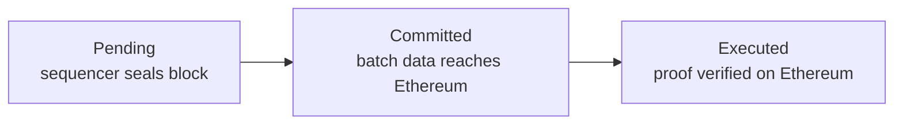

# How ADI Chain is Validated

ADI Chain is a zkRollup that settles to Ethereum. It does not use an ADI validator set to approve blocks.

A sequencer orders transactions and produces L2 blocks. A prover then proves each batch executed according to ADI's rules. Ethereum accepts the resulting state only after its verifier contract accepts that proof.

### Votes vs. Cryptographic Receipts

Traditional L1 networks use a consensus set. Ethereum Proof of Stake, BNB PoSA, and Tron DPoS use different membership and voting models.

In each model, participating validators propose or vote on blocks. The network accepts a block when its consensus rules are met. Its safety relies on the relevant honesty threshold holding.

ADI has a different settlement model:

1. The sequencer executes transactions and seals L2 blocks.
2. The prover generates a zero-knowledge validity proof for a batch.
3. Ethereum verifies that proof through an L1 verifier contract.

The proof is a cryptographic receipt for the computation. It attests that the batch transforms the prior state into the claimed new state.

If the proof is invalid, the verifier contract rejects the batch. No ADI validator vote can override that result.


Ethereum validators still secure Ethereum's own consensus and transaction inclusion. They do not vote on whether an ADI batch is valid. The verifier contract makes that decision from the proof.


### How ADI proves a batch

ADI runs the same execution logic in the sequencer and proving environments. The sequencer uses the normal execution target. The prover runs the deterministic RISC-V target.

[Airbender](../adi-network-components/airbender.md) produces a STARK proof for that execution. A FFLONK SNARK wrapper compresses the final proof for efficient Ethereum verification.

The L1 batch lifecycle is:

* **Pending** means the sequencer sealed the block.
* **Committed** means the batch is committed on Ethereum.
* **Executed** means Ethereum verified the proof. This is fully final.

See [Finality](../references/json-rpc-api/finality.md) for the corresponding RPC stages and block tags.

### Independent Verification is Open to Everyone

Proof verification is not restricted to an operator role. Anyone can inspect the public L2 data and the proof submitted to Ethereum.

Airbender's proving workflow is reproducible. An exchange, institution, auditor, or community operator can independently replay the public execution data, regenerate the proof, and verify the submitted result.

This needs no stake, validator seat, or permissioned membership. A mismatch between the published data, proof, and claimed state transition is detectable.

This differs from the _acceptance mechanism_ on a validator-based L1. An L1 observer can run a node and validate its rules independently. Yet canonical block acceptance still depends on the network's consensus threshold. ADI batch acceptance at settlement depends on the verifier contract accepting a proof.

### A Web2 Mental Model

Think of validator consensus as an approval workflow. Authorized participants vote, and the system trusts the required threshold.

Think of a validity proof as a cryptographic receipt. Ethereum checks the receipt against the execution rules. It accepts the batch only when the check passes.

This avoids optimistic-rollup dispute windows. ADI does not wait for someone to challenge a batch. Finality follows proof generation, Ethereum inclusion, and on-chain verification.

Actual timing depends on batch formation, proof generation, and Ethereum processing. It is not a fixed validator-vote settlement period.

### What each component does

* **Sequencer:** orders transactions and produces L2 blocks. It provides fast pending confirmations.
* **Prover:** creates the Airbender STARK and FFLONK proof for a batch.
* **Ethereum verifier:** rejects invalid proofs and accepts valid state transitions.
* **Independent observers:** reproduce and check the public computation without joining a validator set.

The sequencer affects liveness and transaction ordering. It cannot make Ethereum accept an invalid state transition.

For architecture details, see [Appendix A — Technical Deep Dive](../appendix/appendix-a-technical-deep-dive.md), [Airbender](../adi-network-components/airbender.md), and [Finality](../references/json-rpc-api/finality.md).
