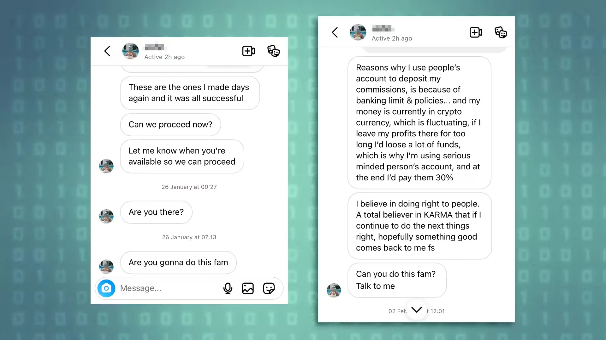

# Protect Yourself From Imposters

Fraudsters target new ecosystems with cloned sites, fake support desks, and social accounts that look real. The guidelines below help you stay safe when interacting with the network.

### Verify Official Domains

* Always type official URLs into your browser.
* Bookmark the correct domain once verified.
* Avoid links from DMs, comments, or forwarded messages.
* Check for subtle spelling changes in domain names.
* Confirm certificates by clicking the browser lock icon.

### Confirm Official Social Channels

* Use links published only on the main website and GitHub.
* Treat any handle that DMs you first as a scam.
* Compare follower counts, post history, and join dates.
* Ignore accounts that promise airdrops, fast support, or guaranteed profits.

### Never Share Sensitive Data

* No admin will ever ask for seed phrases, private keys, or wallet screenshots.
* Do not paste keys or signer outputs into chat rooms.
* If a support post asks you to “verify your wallet,” assume it is fake.

### Validate Announcements

* Cross check any upgrade, airdrop, or migration announcement with the main website and GitHub.
* Real updates are published across all official channels at the same time.
* Fake announcements usually include urgency, countdowns, or pressure to connect your wallet.

### Protect Wallet Interactions

* Inspect every transaction in your wallet before signing.
* If the origin domain looks off, reject the request.
* Use hardware wallets for material value.
* Revoke old approvals periodically using reknown popular tools.

### Use Trusted Downloads Only

* Install browser extensions, wallets, and tooling from verified vendor pages.
* Never install packages sent over private messages on Telegram, Discord, or X.

### Secure Your Communication Path

* Treat Discord DMs as compromised by default.
* Disable DM permissions in community servers.
* Use official forums or GitHub Issues for technical support when possible.

### Call Out Suspicious Activity

* Share posts about unusual behavior in Discord and socials.
* Contact the channel managers or admins.

### Quick Checklist

* Verify domain
* Verify social handle
* Reject unsolicited DMs
* Never share keys
* Cross check announcements
* Inspect every signature
* Use trusted downloads
* Report scams

Stay strict with verification. Scams rely on speed and distraction. Slow down and confirm each surface before you interact.

***

## Examples

Below are just a few real world examples, imposters are creative and will use more channels than the ones below given the chance:

### Scam DMs

<figure><figcaption></figcaption></figure>

<figure><figcaption></figcaption></figure>

**Read More:**\
[https://me-en.kaspersky.com/blog/twitter-fake-crypto-scheme/20549](https://me-en.kaspersky.com/blog/twitter-fake-crypto-scheme/20549)

***

### Scam Exchanges

#### CEX

<figure><figcaption></figcaption></figure>

<figure><figcaption></figcaption></figure>

**Read More:**\
[https://techforing.com/resources/articles/list-of-fake-crypto-exchanges](https://techforing.com/resources/articles/list-of-fake-crypto-exchanges)\
[https://bingx.com/en/learn/article/top-crypto-phishing-scams-to-know-and-how-to-spot-them](https://bingx.com/en/learn/article/top-crypto-phishing-scams-to-know-and-how-to-spot-them)

#### DEX

Decentralized exchanges can be hacked, or even worse, be developed to steal your funds.

To minimise risk:

* Verify the exchange has been audited by multiple independent auditors.
* Verify contracts are verified on block explorers.
* Verify the team behind the exchange has been identified.
* Verify withdrawals work as reliably as deposits using small amounts.

**Read More:**\
[https://www.binance.com/ar/blog/security/7315134930728698372](https://www.binance.com/ar/blog/security/7315134930728698372)\
[https://www.mexc.com/en-NG/news/hypervaultfi-goes-for-suspected-rug-pull-takes-3-6m-from-hyperliquid-users-and-nukes-x-account/110461](https://www.mexc.com/en-NG/news/hypervaultfi-goes-for-suspected-rug-pull-takes-3-6m-from-hyperliquid-users-and-nukes-x-account/110461)

***

### Scam Posts

<figure><figcaption></figcaption></figure>

<figure><figcaption></figcaption></figure>

* Popular accounts are impersonated or copied, including company accounts, with slightly different names.
* Sometimes social and company accounts get hacked, then post about a new coin that is a scam.

**Read More:**\
[https://www.certik.com/resources/blog/social-media-crypto-scams](https://www.certik.com/resources/blog/social-media-crypto-scams)
