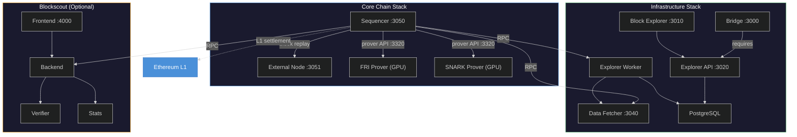
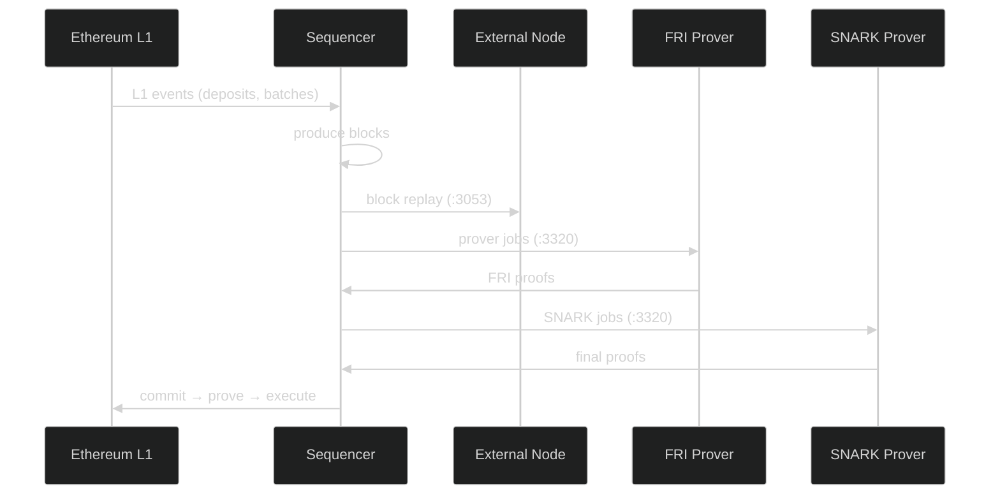
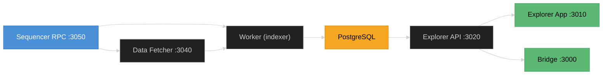

# Running an ADI Rollup with Docker Compose

This guide walks you through deploying a complete ADI Rollup stack using Docker Compose. The deployment is modular — start the core chain, then layer on infrastructure services as needed.

The stack is split into three compose files:

* **Core Stack** — Sequencer, External Node, and GPU Provers (FRI + SNARK)
* **Infrastructure Stack** — Block Explorer and Bridge
* **Blockscout** — Optional alternative block explorer with contract verification



> **Warning:** The **Bridge requires the Block Explorer** to function. Blockscout is an additional explorer with contract verification support, but it cannot replace the Block Explorer for bridge operations.

---

## Prerequisites

### Hardware Requirements

| Component | CPU | RAM | GPU VRAM | Storage |
|-----------|-----|-----|----------|---------|
| Sequencer | 8+ cores | 16 GB+ | — | 100 GB SSD |
| External Node | 4+ cores | 8 GB+ | — | 100 GB SSD |
| FRI Prover | 4+ cores | 16 GB+ | 32 GB+ | 50 GB |
| SNARK Prover | 4+ cores | 32 GB+ | 32 GB+ | 50 GB |
| Infrastructure (Explorer + Bridge) | 2+ cores | 4 GB+ | — | 20 GB |

> **Note:** The entire stack (sequencer + provers) can run on a single machine with ~80 GB of system RAM. SNARK provers with less than 32 GB VRAM will fail with out-of-memory errors.

### Software Requirements

* **Docker Engine** 24.0+ with Compose V2
* **NVIDIA Container Toolkit** — required for GPU provers
* **NVIDIA drivers** with CUDA 12.2+ support
* A `genesis.json` configuration file for your chain
* An L1 RPC endpoint (e.g., ADI OS Testnet)

### Verify Docker and GPU Setup

```bash
# Docker
docker --version
docker compose version

# NVIDIA (on prover nodes)
nvidia-smi
docker run --rm --gpus all nvidia/cuda:12.2.0-base-ubuntu22.04 nvidia-smi
```

> **Tip:** If both commands return version information and the GPU test container runs successfully, your environment is ready.

---

## Directory Structure

Create the following layout on your server:

```
adi-rollup/
├── docker-compose.yml              # Core stack
├── docker-compose.infra.yml        # Infrastructure stack
├── docker-compose.blockscout.yml   # Optional Blockscout
├── .env                            # Environment variables
├── genesis.json                    # Chain genesis configuration
└── volumes/                        # Persistent data (auto-created)
    ├── chain/                      # Sequencer state
    ├── en_chain/                   # External Node state
    ├── shared/                     # Shared prover artifacts
    └── prover/                     # Prover output
```

```bash
mkdir -p adi-rollup && cd adi-rollup
mkdir -p volumes/{chain,en_chain,shared,prover}
```

---

## Step 1 — Environment Configuration

Create a `.env` file with your chain parameters. All compose files read from this shared configuration.

```bash
cat > .env << 'EOF'
# ── Chain Identity ──────────────────────────────────
CHAIN_NAME="My ADI Rollup"
CHAIN_SHORT_NAME=myrollup
CHAIN_ID=444
CHAIN_CURRENCY_SYMBOL=ADI
CHAIN_CURRENCY_NAME="ADI Token"

# ── L1 Connection ──────────────────────────────────
L1_RPC_URL=https://rpc.ab.testnet.adifoundation.ai

# ── Contract Addresses (from chain deployment) ─────
BRIDGEHUB_ADDRESS=0x274e31b8fc1ef5de0de9efcefa1b7097c1cc4560
BYTECODE_SUPPLIER_ADDRESS=0xa21084dd19e51ab1fdbd21fab4fcc2f73eb3cea0
DIAMOND_PROXY_ADDRESS=0xfea43989ac9cc0163eab599e1fccd47c478641ed

# ── L1 Operator Keys ──────────────────────────────
OPERATOR_COMMIT_PK=0x<your-commit-private-key>
OPERATOR_PROVE_PK=0x<your-prove-private-key>
OPERATOR_EXECUTE_PK=0x<your-execute-private-key>

# ── Sequencer P2P Network ──────────────────────────
SEQUENCER_NETWORK_KEY=<64-hex-char-random-key>
EN_NETWORK_KEY=<64-hex-char-random-key>
# See "Deriving the enode URL" below for how to get this value
SEQUENCER_ENODE=enode://<128-hex-char-pubkey>@127.0.0.1:3060

# ── Image Versions ─────────────────────────────────
SERVER_IMAGE=harbor.sre.ideasoft.io/adi-chain/server:v0.16.0-b1
EN_IMAGE=harbor.sre.ideasoft.io/adi-chain/external-node:v0.16.0-b1
PROVER_FRI_IMAGE=ghcr.io/matter-labs/zksync-os-prover-fri:v0.7.0
PROVER_SNARK_IMAGE=ghcr.io/matter-labs/zksync-os-prover-snark:v0.7.0
EXPLORER_APP_IMAGE=harbor.sde.adifoundation.ai/adi-chain/explorer-app:latest
EXPLORER_API_IMAGE=harbor.sde.adifoundation.ai/adi-chain/explorer-api:latest
EXPLORER_WORKER_IMAGE=harbor.sde.adifoundation.ai/adi-chain/explorer-worker:latest
EXPLORER_DATA_FETCHER_IMAGE=harbor.sde.adifoundation.ai/adi-chain/explorer-data-fetcher:latest
BRIDGE_IMAGE=harbor.sde.adifoundation.ai/adi-chain/bridge:latest

# ── GPU Devices ────────────────────────────────────
# Run `nvidia-smi -L` to list GPU or MIG instance UUIDs
GPU_DEVICE_FRI=GPU-xxxxxxxx-xxxx-xxxx-xxxx-xxxxxxxxxxxx
GPU_DEVICE_SNARK=GPU-yyyyyyyy-yyyy-yyyy-yyyy-yyyyyyyyyyyy

# ── Blockscout (optional) ──────────────────────────
SECRET_KEY_BASE=<generate-with: openssl rand -hex 32>
BLOCKSCOUT_DB_PASSWORD=<strong-password>
EOF
```

> **Warning:** Never commit `.env` to version control. It contains private keys and secrets. Use dedicated operator wallets — never use keys holding significant funds.

Generate random keys with:

```bash
openssl rand -hex 32
```

### Deriving the Enode URL

The `SEQUENCER_ENODE` requires the uncompressed secp256k1 public key derived from `SEQUENCER_NETWORK_KEY`. The enode format is:

```
enode://<128-hex-char-pubkey>@<sequencer-ip>:<sequencer-p2p-port>
```

Derive it with Python:

```bash
pip install eciespy
python3 -c "
from ecies import utils
key = utils.generate_key(bytes.fromhex('YOUR_SEQUENCER_NETWORK_KEY'))
print('enode://' + key.public_key.format(False).hex()[2:] + '@127.0.0.1:3060')
"
```

Replace `YOUR_SEQUENCER_NETWORK_KEY` with the value of `SEQUENCER_NETWORK_KEY` from your `.env` file.

---

## Step 2 — Core Chain Stack

The core stack runs the **Sequencer** (block production), **External Node** (read replica), and **GPU Provers** (ZK proof generation).



Create `docker-compose.yml`:

```yaml
services:
  # ─────────────────────────────────────────────
  # Sequencer — produces blocks and batches
  # ─────────────────────────────────────────────
  server:
    image: ${SERVER_IMAGE}
    container_name: ${CHAIN_SHORT_NAME}-sequencer
    restart: unless-stopped
    network_mode: host
    working_dir: /app
    environment:
      # Fee overrides
      sequencer_base_fee_override: "0x3e8"
      sequencer_pubdata_price_override: "0x1"
      sequencer_native_price_override: "0x1"
      sequencer_block_dump_path: "/chain/db/block_dumps"

      # Price oracle
      external_price_api_client_source: "Forced"
      external_price_api_client_forced_prices__json: '{"0x0000000000000000000000000000000000000000": 1.0}'

      # P2P network
      network_enabled: "true"
      network_secret_key: "${SEQUENCER_NETWORK_KEY}"
      network_port: "3060"

      # Storage
      general_rocks_db_path: "/chain/db/node1"

      # L1 connection
      general_l1_rpc_url: "${L1_RPC_URL}"

      # Genesis
      genesis_bridgehub_address: "${BRIDGEHUB_ADDRESS}"
      genesis_bytecode_supplier_address: "${BYTECODE_SUPPLIER_ADDRESS}"
      genesis_genesis_input_path: "/genesis/genesis.json"
      genesis_chain_id: ${CHAIN_ID}

      # L1 gas
      l1_sender_max_fee_per_blob_gas_gwei: 1000

      # Prover API
      prover_api_object_store_file_backed_base_path: "/shared"
      prover_api_component_enabled: "true"
      prover_api_fake_fri_provers_enabled: "false"
      prover_api_fake_snark_provers_enabled: "false"
      prover_api_address: "0.0.0.0:3320"
      prover_input_generator_app_bin_unpack_path: "/chain/db/app_bins"
      prover_input_generator_maximum_in_flight_blocks: 120
      prover_api_fri_job_timeout: "1200s"
      prover_api_snark_job_timeout: "1200s"

      # Batching
      batcher_batch_timeout: "60s"
      batcher_blocks_per_batch_limit: 1400
      sequencer_max_transactions_in_block: 3000

      # L1 operator keys
      l1_sender_operator_commit_pk: ${OPERATOR_COMMIT_PK}
      l1_sender_operator_prove_pk: ${OPERATOR_PROVE_PK}
      l1_sender_operator_execute_pk: ${OPERATOR_EXECUTE_PK}
      l1_sender_max_fee_per_gas_gwei: 1000
      l1_sender_max_priority_fee_per_gas_gwei: 1000
      l1_sender_fusaka_upgrade_timestamp: 0
      l1_sender_pubdata_mode: "Calldata"

      RUST_LOG: "info"
    volumes:
      - ./volumes/chain:/chain
      - ./volumes/shared:/shared
      - ./genesis.json:/genesis/genesis.json:ro

  # ─────────────────────────────────────────────
  # External Node — syncs from sequencer
  # ─────────────────────────────────────────────
  external-node:
    image: ${EN_IMAGE}
    container_name: ${CHAIN_SHORT_NAME}-external-node
    restart: unless-stopped
    network_mode: host
    working_dir: /app
    depends_on: [server]
    environment:
      # EN mode
      general_node_role: "external"
      sequencer_block_replay_download_address: "http://127.0.0.1:3053"
      sequencer_block_replay_server_address: "0.0.0.0:3078"
      general_main_node_rpc_url: "http://127.0.0.1:3050"

      # EN network ports (avoid conflicts with sequencer)
      rpc_address: "0.0.0.0:3051"
      status_server_address: "0.0.0.0:3072"
      observability_prometheus_port: "3316"
      private_api_address: "127.0.0.1:8547"

      # P2P
      network_enabled: "true"
      network_secret_key: "${EN_NETWORK_KEY}"
      network_address: "127.0.0.1"
      network_port: "3061"
      network_boot_nodes: "${SEQUENCER_ENODE}"

      # Fee overrides (must match sequencer)
      sequencer_base_fee_override: "0x3E8"
      sequencer_pubdata_price_override: "0x1"
      sequencer_native_price_override: "0x1"
      external_price_api_client_source: "Forced"

      # Storage
      general_rocks_db_path: "/chain/db/node1"
      sequencer_block_dump_path: "/chain/db/block_dumps"

      # L1 / Genesis
      general_l1_rpc_url: "${L1_RPC_URL}"
      genesis_bridgehub_address: "${BRIDGEHUB_ADDRESS}"
      genesis_bytecode_supplier_address: "${BYTECODE_SUPPLIER_ADDRESS}"
      genesis_genesis_input_path: "/genesis/genesis.json"
      genesis_chain_id: ${CHAIN_ID}
      l1_sender_max_fee_per_blob_gas_gwei: 1000

      # Shared store
      prover_api_object_store_file_backed_base_path: "/shared"

      # Batching
      batcher_batch_timeout: "60s"
      batcher_blocks_per_batch_limit: 10

      RUST_LOG: "info"
    volumes:
      - ./volumes/en_chain:/chain
      - ./volumes/shared:/shared
      - ./genesis.json:/genesis/genesis.json:ro

  # ─────────────────────────────────────────────
  # FRI Prover — generates FRI proofs (GPU)
  # ─────────────────────────────────────────────
  fri-prover:
    image: ${PROVER_FRI_IMAGE}
    container_name: ${CHAIN_SHORT_NAME}-fri-prover
    restart: unless-stopped
    network_mode: host
    depends_on: [server]
    environment:
      RUST_LOG: "info"
    volumes:
      - ./volumes/prover:/prover
    command:
      - "--base-url"
      - "http://127.0.0.1:3320"
      - "--app-bin-path"
      - "/multiblock_batch.bin"
      - "--enabled-logging"
      - "--prover-name"
      - "fri-prover-1"
      - "--prometheus-port"
      - "3124"
    deploy:
      resources:
        reservations:
          devices:
            - driver: nvidia
              device_ids: ["${GPU_DEVICE_FRI}"]
              capabilities: [gpu]

  # ─────────────────────────────────────────────
  # SNARK Prover — generates final SNARK proofs (GPU)
  # ─────────────────────────────────────────────
  snark-prover:
    image: ${PROVER_SNARK_IMAGE}
    container_name: ${CHAIN_SHORT_NAME}-snark-prover
    restart: unless-stopped
    network_mode: host
    depends_on: [server]
    environment:
      RUST_MIN_STACK: "267108864"
    volumes:
      - ./volumes/prover:/prover
    command:
      - "run-prover"
      - "--sequencer-url"
      - "http://127.0.0.1:3320"
      - "--binary-path"
      - "/multiblock_batch.bin"
      - "--trusted-setup-file"
      - "/setup_compact.key"
      - "--output-dir"
      - "/prover"
      - "--prover-name"
      - "snark-prover-1"
      - "--prometheus-port"
      - "3126"
    deploy:
      resources:
        reservations:
          devices:
            - driver: nvidia
              device_ids: ["${GPU_DEVICE_SNARK}"]
              capabilities: [gpu]
```

### Start the Core Stack

```bash
docker compose up -d
```

### Verify

```bash
# Check all containers are running
docker compose ps

# Follow sequencer logs
docker compose logs -f server

# Test the RPC endpoint
curl -s -X POST http://localhost:3050 \
  -H "Content-Type: application/json" \
  -d '{"jsonrpc":"2.0","method":"eth_chainId","params":[],"id":1}'
```

> **Tip:** A successful response returns your chain ID in hex (e.g., `0x1bc` for chain ID 444). The External Node RPC is available at `http://localhost:3051`.

---

## Step 3 — Infrastructure Stack

The infrastructure stack provides the **Block Explorer** and the **Bridge**. The Bridge depends on the Block Explorer API to display transaction history and block data, so both must run together.



Create `docker-compose.infra.yml`:

```yaml
services:
  # ─────────────────────────────────────────────
  # PostgreSQL — explorer database
  # ─────────────────────────────────────────────
  postgres:
    image: postgres:14
    container_name: ${CHAIN_SHORT_NAME}-explorer-db
    restart: unless-stopped
    volumes:
      - explorer_db_data:/var/lib/postgresql/data
    healthcheck:
      test: ["CMD-SHELL", "pg_isready -U postgres"]
      interval: 5s
      timeout: 5s
      retries: 5
    environment:
      POSTGRES_USER: postgres
      POSTGRES_PASSWORD: postgres
      POSTGRES_DB: block-explorer

  # ─────────────────────────────────────────────
  # Explorer — Data Fetcher
  # ─────────────────────────────────────────────
  explorer-data-fetcher:
    image: ${EXPLORER_DATA_FETCHER_IMAGE}
    container_name: ${CHAIN_SHORT_NAME}-explorer-data-fetcher
    restart: unless-stopped
    ports:
      - "3040:3040"
    environment:
      PORT: 3040
      LOG_LEVEL: verbose
      BLOCKCHAIN_RPC_URL: http://host.docker.internal:3050
      RPC_BATCH_MAX_COUNT: 50
      RPC_CALLS_CONNECTION_QUICK_TIMEOUT: 30000
    extra_hosts:
      - "host.docker.internal:host-gateway"

  # ─────────────────────────────────────────────
  # Explorer — Worker (blockchain indexer)
  # ─────────────────────────────────────────────
  explorer-worker:
    image: ${EXPLORER_WORKER_IMAGE}
    container_name: ${CHAIN_SHORT_NAME}-explorer-worker
    restart: unless-stopped
    ports:
      - "3001:3001"
    environment:
      PORT: 3001
      LOG_LEVEL: verbose
      DATABASE_HOST: postgres
      DATABASE_USER: postgres
      DATABASE_PASSWORD: postgres
      DATABASE_NAME: block-explorer
      BLOCKCHAIN_RPC_URL: http://host.docker.internal:3050
      DATA_FETCHER_URL: http://explorer-data-fetcher:3040
      BASE_TOKEN_SYMBOL: ${CHAIN_CURRENCY_SYMBOL:-ADI}
      BASE_TOKEN_NAME: ${CHAIN_CURRENCY_NAME:-ADI Token}
      BASE_TOKEN_ICON_URL: /images/icons/adi-logo.svg
      SETTLEMENT_RPC_URL: ${L1_RPC_URL:-https://rpc.ab.testnet.adifoundation.ai}
      DIAMOND_PROXY_ADDRESS: ${DIAMOND_PROXY_ADDRESS}
      SETTLEMENT_BATCH_INDEXER_POLLING_INTERVAL: 10000
    extra_hosts:
      - "host.docker.internal:host-gateway"
    depends_on:
      postgres:
        condition: service_healthy

  # ─────────────────────────────────────────────
  # Explorer — API
  # ─────────────────────────────────────────────
  explorer-api:
    image: ${EXPLORER_API_IMAGE}
    container_name: ${CHAIN_SHORT_NAME}-explorer-api
    restart: unless-stopped
    ports:
      - "3020:3020"
    environment:
      PORT: 3020
      LOG_LEVEL: verbose
      DATABASE_HOST: postgres
      DATABASE_USER: postgres
      DATABASE_PASSWORD: postgres
      DATABASE_NAME: block-explorer
      BASE_TOKEN_SYMBOL: ${CHAIN_CURRENCY_SYMBOL:-ADI}
      BASE_TOKEN_NAME: ${CHAIN_CURRENCY_NAME:-ADI Token}
      BASE_TOKEN_L1_ADDRESS: "0x000000000000000000000000000000000000800A"
      BASE_TOKEN_ICON_URL: /images/icons/adi-logo.svg
    depends_on:
      - explorer-worker

  # ─────────────────────────────────────────────
  # Explorer — App (frontend)
  # ─────────────────────────────────────────────
  explorer-app:
    image: ${EXPLORER_APP_IMAGE}
    container_name: ${CHAIN_SHORT_NAME}-explorer-app
    restart: unless-stopped
    ports:
      - "3010:3010"
    environment:
      VITE_BRAND_NAME: ADI
      APP_NETWORK_NAME: "${CHAIN_NAME:-ADI Chain}"
      APP_L2_CHAIN_ID: ${CHAIN_ID:-444}
      APP_RPC_URL: http://localhost:3050
      APP_API_URL: http://localhost:3020
      APP_BASE_TOKEN_ADDRESS: "0x000000000000000000000000000000000000800A"
      APP_L1_EXPLORER_URL: https://explorer.ab.testnet.adifoundation.ai
      APP_BRIDGE_URL: http://localhost:3000
      APP_SETTLEMENT_CHAIN_NAME: "ADI Testnet"
      APP_SETTLEMENT_CHAIN_ID: 99999
    extra_hosts:
      - "host.docker.internal:host-gateway"
    depends_on:
      - explorer-api

  # ─────────────────────────────────────────────
  # Bridge (dApp Portal)
  # ─────────────────────────────────────────────
  bridge:
    image: ${BRIDGE_IMAGE}
    container_name: ${CHAIN_SHORT_NAME}-bridge
    restart: unless-stopped
    ports:
      - "3000:3000"
    extra_hosts:
      - "host.docker.internal:host-gateway"
    environment:
      RUNTIME_CONFIG: >
        {
          "nodeType": "hyperchain",
          "hyperchainsConfig": [
            {
              "network": {
                "id": ${CHAIN_ID:-444},
                "name": "${CHAIN_NAME:-ADI Chain}",
                "key": "${CHAIN_SHORT_NAME:-myrollup}",
                "rpcUrl": "http://localhost:3050/",
                "blockExplorerUrl": "http://localhost:3010/",
                "blockExplorerApi": "http://localhost:3020",
                "l1BlockExplorerApi": "https://explorer-api.ab.testnet.adifoundation.ai",
                "nativeTokenBridgingOnly": false,
                "nativeCurrency": {
                  "name": "${CHAIN_CURRENCY_NAME:-ADI Token}",
                  "symbol": "${CHAIN_CURRENCY_SYMBOL:-ADI}",
                  "decimals": 18
                },
                "l1Network": {
                  "id": 99999,
                  "name": "ADI OS Testnet",
                  "network": "adi_testnet",
                  "nativeCurrency": {
                    "name": "ADI Token",
                    "symbol": "ADI",
                    "decimals": 18
                  },
                  "rpcUrls": {
                    "default": {
                      "http": ["${L1_RPC_URL:-https://rpc.ab.testnet.adifoundation.ai}"]
                    },
                    "public": {
                      "http": ["${L1_RPC_URL:-https://rpc.ab.testnet.adifoundation.ai}"]
                    }
                  }
                }
              },
              "tokens": [
                {
                  "address": "0x000000000000000000000000000000000000800A",
                  "l1Address": "0x0000000000000000000000000000000000000000",
                  "symbol": "${CHAIN_CURRENCY_SYMBOL:-ADI}",
                  "name": "${CHAIN_CURRENCY_NAME:-ADI Token}",
                  "decimals": 18,
                  "iconUrl": "/img/adi.svg"
                }
              ]
            }
          ]
        }

volumes:
  explorer_db_data:
    name: ${CHAIN_SHORT_NAME:-myrollup}_explorer_db_data
```

### Start the Infrastructure Stack

```bash
docker compose -f docker-compose.infra.yml up -d
```

### Verify

| Service | URL | What to Expect |
|---------|-----|----------------|
| Block Explorer | `http://localhost:3010` | Block explorer UI — blocks, transactions, accounts |
| Explorer API | `http://localhost:3020` | REST API for blockchain data |
| Bridge | `http://localhost:3000` | Deposit and withdrawal interface |

> **Warning:** The Bridge will not display any network data until the Block Explorer worker has indexed at least a few blocks. Allow a minute for the initial sync to complete.

---

## Step 4 — Blockscout Explorer (Optional)

[Blockscout](https://www.blockscout.com/) provides an alternative block explorer with smart contract verification (Solidity + Vyper), Solidity-to-UML visualization, function signature decoding, and chain statistics.

> **Warning:** Blockscout is entirely optional and runs independently from the Block Explorer. The Bridge requires the **Block Explorer** (Step 3) — not Blockscout. You can run both explorers side by side.

Create `docker-compose.blockscout.yml`:

```yaml
services:
  # ─────────────────────────────────────────────
  # Blockscout — PostgreSQL
  # ─────────────────────────────────────────────
  blockscout-db:
    image: postgres:15-alpine
    container_name: ${CHAIN_SHORT_NAME:-adi}-blockscout-db
    restart: unless-stopped
    command: postgres -c max_connections=300
    environment:
      POSTGRES_PASSWORD: ${BLOCKSCOUT_DB_PASSWORD:-postgres}
      POSTGRES_USER: blockscout
      POSTGRES_DB: blockscout
    volumes:
      - blockscout_db_data:/var/lib/postgresql/data
    healthcheck:
      test: ["CMD-SHELL", "pg_isready -U blockscout -d blockscout"]
      interval: 10s
      timeout: 5s
      retries: 5
      start_period: 10s

  # ─────────────────────────────────────────────
  # Blockscout — Redis
  # ─────────────────────────────────────────────
  blockscout-redis:
    image: redis:7-alpine
    container_name: ${CHAIN_SHORT_NAME:-adi}-blockscout-redis
    restart: unless-stopped
    command: redis-server --maxmemory 256mb --maxmemory-policy allkeys-lru
    healthcheck:
      test: ["CMD", "redis-cli", "ping"]
      interval: 10s
      timeout: 5s
      retries: 5

  # ─────────────────────────────────────────────
  # Blockscout — Backend
  # ─────────────────────────────────────────────
  blockscout-backend:
    image: ghcr.io/blockscout/blockscout:${BLOCKSCOUT_VERSION:-latest}
    container_name: ${CHAIN_SHORT_NAME:-adi}-blockscout-backend
    restart: unless-stopped
    command: >
      sh -c "bin/blockscout eval \"Elixir.Explorer.ReleaseTasks.create_and_migrate()\"
      && bin/blockscout start"
    environment:
      DATABASE_URL: postgresql://blockscout:${BLOCKSCOUT_DB_PASSWORD:-postgres}@blockscout-db:5432/blockscout
      ECTO_USE_SSL: "false"
      POOL_SIZE: "80"
      POOL_SIZE_API: "10"
      ETHEREUM_JSONRPC_HTTP_URL: http://${RPC_HOST:-172.17.0.1}:${RPC_PORT:-3050}
      ETHEREUM_JSONRPC_TRACE_URL: http://${RPC_HOST:-172.17.0.1}:${RPC_PORT:-3050}
      ETHEREUM_JSONRPC_TRANSPORT: http
      ETHEREUM_JSONRPC_VARIANT: geth
      CHAIN_ID: ${CHAIN_ID:-444}
      COIN: ${CHAIN_CURRENCY_SYMBOL:-ADI}
      COIN_NAME: ${CHAIN_CURRENCY_NAME:-ADI Token}
      INDEXER_DISABLE_INTERNAL_TRANSACTIONS_FETCHER: "true"
      INDEXER_DISABLE_PENDING_TRANSACTIONS_FETCHER: "true"
      INDEXER_BEACON_BLOB_FETCHER_DISABLED: "true"
      PORT: 4000
      ACCOUNT_ENABLED: "false"
      DISABLE_MARKET: "true"
      SECRET_KEY_BASE: ${SECRET_KEY_BASE:?Run openssl rand -hex 32 and set SECRET_KEY_BASE in .env}
      ACCOUNT_REDIS_URL: redis://blockscout-redis:6379/0
      MICROSERVICE_SC_VERIFIER_ENABLED: "true"
      MICROSERVICE_SC_VERIFIER_URL: http://blockscout-verifier:8050
      MICROSERVICE_SC_VERIFIER_TYPE: sc_verifier
      MICROSERVICE_VISUALIZE_SOL2UML_ENABLED: "true"
      MICROSERVICE_VISUALIZE_SOL2UML_URL: http://blockscout-visualizer:8050
      MICROSERVICE_SIG_PROVIDER_ENABLED: "true"
      MICROSERVICE_SIG_PROVIDER_URL: http://blockscout-sig-provider:8050
    extra_hosts:
      - "host.docker.internal:host-gateway"
    depends_on:
      blockscout-db:
        condition: service_healthy
      blockscout-redis:
        condition: service_healthy
    healthcheck:
      test: ["CMD", "curl", "-f", "http://localhost:4000/api/v2/stats"]
      interval: 30s
      timeout: 10s
      retries: 5
      start_period: 120s

  # ─────────────────────────────────────────────
  # Blockscout — Frontend
  # ─────────────────────────────────────────────
  blockscout-frontend:
    image: ghcr.io/blockscout/frontend:${BLOCKSCOUT_FRONTEND_VERSION:-latest}
    container_name: ${CHAIN_SHORT_NAME:-adi}-blockscout-frontend
    restart: unless-stopped
    ports:
      - "4000:3000"
    environment:
      NEXT_PUBLIC_APP_HOST: localhost
      NEXT_PUBLIC_APP_PORT: 4000
      NEXT_PUBLIC_APP_PROTOCOL: http
      NEXT_PUBLIC_API_HOST: blockscout-backend
      NEXT_PUBLIC_API_PORT: 4000
      NEXT_PUBLIC_API_PROTOCOL: http
      NEXT_PUBLIC_API_BASE_PATH: /
      NEXT_PUBLIC_API_WEBSOCKET_PROTOCOL: ws
      NEXT_PUBLIC_NETWORK_NAME: "${CHAIN_NAME:-ADI Chain}"
      NEXT_PUBLIC_NETWORK_SHORT_NAME: "${CHAIN_SHORT_NAME:-adi}"
      NEXT_PUBLIC_NETWORK_ID: ${CHAIN_ID:-444}
      NEXT_PUBLIC_NETWORK_CURRENCY_NAME: "${CHAIN_CURRENCY_NAME:-ADI Token}"
      NEXT_PUBLIC_NETWORK_CURRENCY_SYMBOL: ${CHAIN_CURRENCY_SYMBOL:-ADI}
      NEXT_PUBLIC_NETWORK_CURRENCY_DECIMALS: 18
      NEXT_PUBLIC_IS_TESTNET: "true"
      NEXT_PUBLIC_VISUALIZE_API_HOST: http://blockscout-visualizer:8050
      NEXT_PUBLIC_STATS_API_HOST: http://blockscout-stats:8050
      NEXT_PUBLIC_AD_BANNER_PROVIDER: none
    depends_on:
      blockscout-backend:
        condition: service_healthy
    healthcheck:
      test: ["CMD", "wget", "-q", "--spider", "http://localhost:3000"]
      interval: 30s
      timeout: 10s
      retries: 3
      start_period: 30s

  # ─────────────────────────────────────────────
  # Blockscout — Smart Contract Verifier
  # ─────────────────────────────────────────────
  blockscout-verifier:
    image: ghcr.io/blockscout/smart-contract-verifier:${BLOCKSCOUT_VERIFIER_VERSION:-latest}
    container_name: ${CHAIN_SHORT_NAME:-adi}-blockscout-verifier
    restart: unless-stopped
    environment:
      SMART_CONTRACT_VERIFIER__SERVER__HTTP__ADDR: 0.0.0.0:8050
      SMART_CONTRACT_VERIFIER__SERVER__HTTP__ENABLED: "true"
      SMART_CONTRACT_VERIFIER__SOLIDITY__ENABLED: "true"
      SMART_CONTRACT_VERIFIER__SOLIDITY__COMPILERS_DIR: /tmp/solidity-compilers
      SMART_CONTRACT_VERIFIER__VYPER__ENABLED: "true"
      SMART_CONTRACT_VERIFIER__VYPER__COMPILERS_DIR: /tmp/vyper-compilers
      SMART_CONTRACT_VERIFIER__SOURCIFY__ENABLED: "true"
      SMART_CONTRACT_VERIFIER__SOURCIFY__API_URL: https://sourcify.dev/server/
    healthcheck:
      test: ["CMD", "wget", "-qO-", "http://localhost:8050/health"]
      interval: 30s
      timeout: 10s
      retries: 3
      start_period: 30s

  # ─────────────────────────────────────────────
  # Blockscout — Visualizer (Solidity UML)
  # ─────────────────────────────────────────────
  blockscout-visualizer:
    image: ghcr.io/blockscout/visualizer:${BLOCKSCOUT_VISUALIZER_VERSION:-latest}
    container_name: ${CHAIN_SHORT_NAME:-adi}-blockscout-visualizer
    restart: unless-stopped
    environment:
      VISUALIZER__SERVER__HTTP__ADDR: 0.0.0.0:8050
    healthcheck:
      test: ["CMD", "wget", "-qO-", "http://localhost:8050/health"]
      interval: 30s
      timeout: 10s
      retries: 3
      start_period: 30s

  # ─────────────────────────────────────────────
  # Blockscout — Signature Provider
  # ─────────────────────────────────────────────
  blockscout-sig-provider:
    image: ghcr.io/blockscout/sig-provider:${BLOCKSCOUT_SIG_PROVIDER_VERSION:-latest}
    container_name: ${CHAIN_SHORT_NAME:-adi}-blockscout-sig-provider
    restart: unless-stopped
    environment:
      SIG_PROVIDER__SERVER__HTTP__ADDR: 0.0.0.0:8050
    healthcheck:
      test: ["CMD", "wget", "-qO-", "http://localhost:8050/health"]
      interval: 30s
      timeout: 10s
      retries: 3
      start_period: 30s

  # ─────────────────────────────────────────────
  # Blockscout — Stats Database
  # ─────────────────────────────────────────────
  blockscout-stats-db:
    image: postgres:15-alpine
    container_name: ${CHAIN_SHORT_NAME:-adi}-blockscout-stats-db
    restart: unless-stopped
    environment:
      POSTGRES_PASSWORD: ${BLOCKSCOUT_DB_PASSWORD:-postgres}
      POSTGRES_USER: stats
      POSTGRES_DB: stats
    volumes:
      - blockscout_stats_db_data:/var/lib/postgresql/data
    healthcheck:
      test: ["CMD-SHELL", "pg_isready -U stats -d stats"]
      interval: 10s
      timeout: 5s
      retries: 5
      start_period: 10s

  # ─────────────────────────────────────────────
  # Blockscout — Stats Service
  # ─────────────────────────────────────────────
  blockscout-stats:
    image: ghcr.io/blockscout/stats:${BLOCKSCOUT_STATS_VERSION:-latest}
    container_name: ${CHAIN_SHORT_NAME:-adi}-blockscout-stats
    restart: unless-stopped
    environment:
      STATS__DB_URL: postgresql://stats:${BLOCKSCOUT_DB_PASSWORD:-postgres}@blockscout-stats-db:5432/stats
      STATS__BLOCKSCOUT_DB_URL: postgresql://blockscout:${BLOCKSCOUT_DB_PASSWORD:-postgres}@blockscout-db:5432/blockscout
      STATS__CREATE_DATABASE: "false"
      STATS__RUN_MIGRATIONS: "true"
      STATS__BLOCKSCOUT_API_URL: http://blockscout-backend:4000
      STATS__SERVER__HTTP__ENABLED: "true"
      STATS__SERVER__HTTP__ADDR: 0.0.0.0:8050
      STATS__SERVER__HTTP__CORS__ENABLED: "true"
      STATS__SERVER__HTTP__CORS__ALLOWED_ORIGIN: http://localhost:4000
      STATS__FORCE_UPDATE_ON_START: "false"
    depends_on:
      blockscout-stats-db:
        condition: service_healthy
      blockscout-backend:
        condition: service_healthy
    healthcheck:
      test: ["CMD", "wget", "-qO-", "http://localhost:8050/health"]
      interval: 30s
      timeout: 10s
      retries: 3
      start_period: 30s

volumes:
  blockscout_db_data:
    name: ${CHAIN_SHORT_NAME:-adi}_blockscout_db_data
  blockscout_stats_db_data:
    name: ${CHAIN_SHORT_NAME:-adi}_blockscout_stats_db_data
```

### Start Blockscout

```bash
docker compose -f docker-compose.blockscout.yml up -d
```

> **Tip:** Blockscout will be available at `http://localhost:4000`. The initial sync may take a few minutes depending on your chain's block count.

---

## Running Everything Together

To bring up the full stack in one command:

```bash
# Core + Infrastructure
docker compose \
  -f docker-compose.yml \
  -f docker-compose.infra.yml \
  up -d

# Core + Infrastructure + Blockscout
docker compose \
  -f docker-compose.yml \
  -f docker-compose.infra.yml \
  -f docker-compose.blockscout.yml \
  up -d
```

---

## Port Reference

| Port | Service | Description |
|------|---------|-------------|
| `3050` | Sequencer | L2 JSON-RPC endpoint |
| `3051` | External Node | L2 JSON-RPC (read replica) |
| `3060` | Sequencer | P2P network |
| `3320` | Sequencer | Prover API (internal) |
| `3000` | Bridge | dApp Portal / Bridge UI |
| `3010` | Explorer App | Block Explorer frontend |
| `3020` | Explorer API | Block Explorer REST API |
| `3040` | Data Fetcher | Explorer data fetcher |
| `4000` | Blockscout | Blockscout frontend (optional) |

---

## GPU Configuration

### Single GPU

If you have a dedicated GPU per prover, use the full GPU UUID:

```bash
nvidia-smi -L
# GPU 0: NVIDIA A100 80GB (UUID: GPU-12345678-abcd-...)
```

Set in `.env`:

```bash
GPU_DEVICE_FRI=GPU-12345678-abcd-...
GPU_DEVICE_SNARK=GPU-87654321-dcba-...
```


### Scaling Provers

For higher proving throughput, add more prover instances. Each needs a unique name and Prometheus port:

```yaml
  fri-prover-2:
    image: ${PROVER_FRI_IMAGE}
    container_name: ${CHAIN_SHORT_NAME}-fri-prover-2
    restart: unless-stopped
    network_mode: host
    depends_on: [server]
    environment:
      RUST_LOG: "info"
    volumes:
      - ./volumes/prover:/prover
    command:
      - "--base-url"
      - "http://127.0.0.1:3320"
      - "--app-bin-path"
      - "/multiblock_batch.bin"
      - "--enabled-logging"
      - "--prover-name"
      - "fri-prover-2"
      - "--prometheus-port"
      - "3125"
    deploy:
      resources:
        reservations:
          devices:
            - driver: nvidia
              device_ids: ["${GPU_DEVICE_FRI_2}"]
              capabilities: [gpu]
```

---

## Operations

### Viewing Logs

```bash
# All services
docker compose logs -f

# Specific service
docker compose logs -f server
docker compose logs -f fri-prover
docker compose logs -f snark-prover

# Infrastructure stack
docker compose -f docker-compose.infra.yml logs -f explorer-worker
```

### Monitoring

| Endpoint | What It Shows |
|----------|---------------|
| `http://localhost:3050` | Sequencer JSON-RPC |
| `http://localhost:3051` | External Node JSON-RPC |
| `http://localhost:3312/metrics` | Sequencer Prometheus metrics |
| `http://localhost:3316/metrics` | External Node Prometheus metrics |
| `http://localhost:3124/metrics` | FRI Prover Prometheus metrics |
| `http://localhost:3126/metrics` | SNARK Prover Prometheus metrics |

Check sync status:

```bash
# Sequencer block number
curl -s -X POST http://localhost:3050 \
  -H "Content-Type: application/json" \
  -d '{"jsonrpc":"2.0","method":"eth_blockNumber","params":[],"id":1}'

# GPU utilization
watch -n 1 nvidia-smi
```

### Restarting Services

```bash
# Restart a single service
docker compose restart server

# Restart the entire core stack
docker compose down && docker compose up -d
```

### Resetting Data

To wipe all data and start from genesis:

```bash
# Stop everything
docker compose down
docker compose -f docker-compose.infra.yml down
docker compose -f docker-compose.blockscout.yml down

# Remove volumes
docker volume prune
rm -rf volumes/*

# Recreate directories and start
mkdir -p volumes/{chain,en_chain,shared,prover}
docker compose up -d
```

> **Warning:** This is irreversible. All chain state, explorer data, and prover artifacts will be deleted.

---

## Configuration Reference

This section covers the most important environment variables and CLI arguments for each component. For the full list of available options, see the linked source repositories.

### Sequencer Configuration

The sequencer uses environment variables in `component_setting_name` format (lowercase, underscore-separated). All settings are defined via the [`smart_config`](https://github.com/ADI-Foundation-Labs/ADI-Stack-Server/tree/main/node/bin/src/config) framework.

#### General

| Variable | Default | Description |
|----------|---------|-------------|
| `general_node_role` | `MainNode` | Node role — `MainNode` (sequencer) or `external` (follower) |
| `general_l1_rpc_url` | `http://localhost:8545` | Ethereum L1 JSON-RPC endpoint |
| `general_rocks_db_path` | `./db` | Path to RocksDB state storage |
| `general_main_node_rpc_url` | — | Main node RPC URL (required for External Nodes) |
| `general_min_blocks_to_replay` | `10` | Minimum blocks to replay on restart |
| `general_force_starting_block_number` | — | Force replay from a specific block number |

#### Sequencer

| Variable | Default | Description |
|----------|---------|-------------|
| `sequencer_block_time` | `250ms` | Block production interval |
| `sequencer_max_transactions_in_block` | `1000` | Maximum transactions per block |
| `sequencer_block_gas_limit` | `100000000` | Gas limit per block |
| `sequencer_block_pubdata_limit_bytes` | `110000` | Pubdata size limit per block |
| `sequencer_base_fee_override` | — | Override base fee (hex, e.g. `0x3e8`) |
| `sequencer_pubdata_price_override` | — | Override pubdata price (hex) |
| `sequencer_native_price_override` | — | Override native token price (hex) |
| `sequencer_block_dump_path` | — | Path to dump block data for replay |
| `sequencer_fee_collector_address` | `0x3661...c049` | Address that collects transaction fees |

#### RPC

| Variable | Default | Description |
|----------|---------|-------------|
| `rpc_address` | `0.0.0.0:3050` | JSON-RPC listen address |
| `rpc_max_connections` | `1000` | Maximum concurrent connections |
| `rpc_eth_call_gas` | `10000000` | Gas limit for `eth_call` |
| `rpc_max_logs_per_response` | `20000` | Maximum log entries returned per request |
| `rpc_max_request_size` | `15` | Maximum request payload size (MB) |
| `rpc_max_response_size` | `24` | Maximum response payload size (MB) |

#### L1 Sender

| Variable | Default | Description |
|----------|---------|-------------|
| `l1_sender_operator_commit_pk` | — | Private key for committing batches to L1 |
| `l1_sender_operator_prove_pk` | — | Private key for submitting proofs to L1 |
| `l1_sender_operator_execute_pk` | — | Private key for executing batches on L1 |
| `l1_sender_max_fee_per_gas_gwei` | `200` | Maximum gas price for L1 transactions (Gwei) |
| `l1_sender_max_priority_fee_per_gas_gwei` | `1` | Maximum priority fee for L1 transactions (Gwei) |
| `l1_sender_max_fee_per_blob_gas_gwei` | `2` | Maximum blob gas price (Gwei) |
| `l1_sender_pubdata_mode` | — | Pubdata availability mode — `Blobs` or `Calldata` |
| `l1_sender_enabled` | `true` | Enable L1 settlement transactions |

#### Prover API (on Sequencer)

| Variable | Default | Description |
|----------|---------|-------------|
| `prover_api_component_enabled` | `true` | Enable the prover API endpoint |
| `prover_api_address` | `0.0.0.0:3124` | Prover API listen address |
| `prover_api_fake_fri_provers_enabled` | `true` | Use fake FRI provers (set `false` for production) |
| `prover_api_fake_snark_provers_enabled` | `true` | Use fake SNARK provers (set `false` for production) |
| `prover_api_fri_job_timeout` | `300s` | Timeout before reassigning a FRI job |
| `prover_api_snark_job_timeout` | `300s` | Timeout before reassigning a SNARK job |
| `prover_api_max_fris_per_snark` | `10` | Maximum FRI proofs aggregated per SNARK proof |
| `prover_api_object_store_file_backed_base_path` | `./db/shared` | Shared object store path for prover artifacts |

#### Batching

| Variable | Default | Description |
|----------|---------|-------------|
| `batcher_batch_timeout` | `1s` | Maximum time to wait before sealing a batch |
| `batcher_blocks_per_batch_limit` | `10` | Maximum blocks per batch |
| `batcher_tx_per_batch_limit` | `10000` | Maximum transactions per batch |

#### P2P Network

| Variable | Default | Description |
|----------|---------|-------------|
| `network_enabled` | `false` | Enable devp2p networking |
| `network_secret_key` | — | 256-bit ECDSA secret key (64 hex chars) |
| `network_address` | `0.0.0.0` | P2P listen address |
| `network_port` | `3060` | P2P listen port |
| `network_boot_nodes` | — | Comma-separated enode URLs for peer discovery |

#### Price Oracle

| Variable | Default | Description |
|----------|---------|-------------|
| `external_price_api_client_source` | — | Price source — `Forced` for static pricing |
| `external_price_api_client_forced_prices__json` | — | JSON map of token address to USD price |

#### Genesis

| Variable | Default | Description |
|----------|---------|-------------|
| `genesis_chain_id` | — | L2 chain ID |
| `genesis_bridgehub_address` | — | L1 Bridgehub contract address |
| `genesis_bytecode_supplier_address` | — | L1 bytecode supplier contract address |
| `genesis_genesis_input_path` | — | Path to `genesis.json` file |

#### Observability

| Variable | Default | Description |
|----------|---------|-------------|
| `observability_prometheus_port` | `3312` | Prometheus metrics port |
| `RUST_LOG` | — | Log level filter (e.g. `info`, `debug`, `warn`) |

> Full server configuration reference: [ADI-Stack-Server/node/bin/src/config](https://github.com/ADI-Foundation-Labs/ADI-Stack-Server/tree/main/node/bin/src/config)

---

### FRI Prover Configuration

The FRI prover is configured via CLI arguments. Environment variables control logging only.

| Argument | Default | Description |
|----------|---------|-------------|
| `--base-url` / `--sequencer-urls` | `http://localhost:3124` | Sequencer prover API URL(s), comma-separated for round-robin |
| `--sequencer-urls-file` | — | Path to file with URLs (one per line), takes precedence over `--sequencer-urls` |
| `--app-bin-path` | `../../multiblock_batch.bin` | Path to the RISC-V binary |
| `--circuit-limit` | `10000` | Maximum MainVM circuits to instantiate |
| `--iterations` | — | Number of proving iterations before exiting (unlimited if omitted) |
| `--prover-name` | `unknown_prover` | Prover identifier for monitoring |
| `--prometheus-port` | `3124` | Prometheus metrics port |
| `--enabled-logging` | `false` | Enable structured logging |
| `--request-timeout-secs` | `2` | HTTP request timeout to sequencer |

| Env Variable | Description |
|--------------|-------------|
| `RUST_LOG` | Log level filter (`debug`, `info`, `warn`, `error`) |

> Full FRI prover source: [ADI-Stack-Airbender-Prover/crates/zksync\_os\_fri\_prover](https://github.com/ADI-Foundation-Labs/ADI-Stack-Airbender-Prover/tree/main/crates/zksync_os_fri_prover)

---

### SNARK Prover Configuration

The SNARK prover uses the `run-prover` subcommand with CLI arguments.

| Argument | Default | Description |
|----------|---------|-------------|
| `--sequencer-url` / `--sequencer-urls` | — | Sequencer prover API URL(s) |
| `--sequencer-urls-file` | — | Path to file with URLs |
| `--binary-path` | — | Path to the RISC-V binary |
| `--trusted-setup-file` | — | Path to the trusted setup key (`setup_compact.key`) |
| `--output-dir` | — | Output directory for SNARK proofs |
| `--iterations` | — | Number of proving iterations before exiting |
| `--prover-name` | — | Prover identifier for monitoring |
| `--prometheus-port` | `3124` | Prometheus metrics port |
| `--disable-zk` | `false` | Disable zero-knowledge property (testing only) |

| Env Variable | Default | Description |
|--------------|---------|-------------|
| `RUST_MIN_STACK` | — | Thread stack size in bytes (recommended: `267108864` = 256 MB) |
| `RUST_LOG` | — | Log level filter |

> Full SNARK prover source: [ADI-Stack-Airbender-Prover/crates/zksync\_os\_snark\_prover](https://github.com/ADI-Foundation-Labs/ADI-Stack-Airbender-Prover/tree/main/crates/zksync_os_snark_prover)

---

### Block Explorer Configuration

The Block Explorer consists of four services. Key environment variables for each:

#### Worker (Indexer)

| Variable | Default | Description |
|----------|---------|-------------|
| `BLOCKCHAIN_RPC_URL` | — | L2 JSON-RPC endpoint to index |
| `DATA_FETCHER_URL` | — | URL of the data fetcher service |
| `DATABASE_HOST` | `localhost` | PostgreSQL host |
| `DATABASE_USER` | `postgres` | PostgreSQL user |
| `DATABASE_PASSWORD` | — | PostgreSQL password |
| `DATABASE_NAME` | `block-explorer` | PostgreSQL database name |
| `SETTLEMENT_RPC_URL` | — | L1 RPC URL for batch settlement tracking |
| `DIAMOND_PROXY_ADDRESS` | — | L1 Diamond Proxy contract address |
| `BASE_TOKEN_SYMBOL` | `ETH` | Base token ticker symbol |
| `BASE_TOKEN_NAME` | `Ether` | Base token display name |

#### API

| Variable | Default | Description |
|----------|---------|-------------|
| `PORT` | `3020` | HTTP listen port |
| `DATABASE_HOST` | `localhost` | PostgreSQL host |
| `DATABASE_USER` | `postgres` | PostgreSQL user |
| `DATABASE_PASSWORD` | — | PostgreSQL password |
| `DATABASE_NAME` | `block-explorer` | PostgreSQL database name |
| `BASE_TOKEN_SYMBOL` | `ETH` | Base token ticker |
| `BASE_TOKEN_L1_ADDRESS` | — | L1 address of the base token |

#### App (Frontend)

| Variable | Default | Description |
|----------|---------|-------------|
| `APP_NETWORK_NAME` | — | Network display name |
| `APP_L2_CHAIN_ID` | — | L2 chain ID |
| `APP_RPC_URL` | — | L2 JSON-RPC URL (used by frontend) |
| `APP_API_URL` | — | Block Explorer API URL |
| `APP_BRIDGE_URL` | — | Bridge UI URL |
| `APP_L1_EXPLORER_URL` | — | L1 block explorer URL |
| `APP_BASE_TOKEN_ADDRESS` | — | Base token contract address on L2 |

#### Data Fetcher

| Variable | Default | Description |
|----------|---------|-------------|
| `PORT` | `3040` | HTTP listen port |
| `BLOCKCHAIN_RPC_URL` | — | L2 JSON-RPC endpoint |
| `RPC_BATCH_MAX_COUNT` | `50` | Maximum batch size for RPC calls |

---

### Bridge (dApp Portal) Configuration

The Bridge is configured via a `RUNTIME_CONFIG` JSON environment variable. Key fields:

| Field | Description |
|-------|-------------|
| `nodeType` | Must be `"hyperchain"` for custom rollups |
| `hyperchainsConfig[].network.id` | L2 chain ID |
| `hyperchainsConfig[].network.name` | Network display name |
| `hyperchainsConfig[].network.rpcUrl` | L2 JSON-RPC endpoint |
| `hyperchainsConfig[].network.blockExplorerUrl` | Block Explorer frontend URL |
| `hyperchainsConfig[].network.blockExplorerApi` | Block Explorer API URL |
| `hyperchainsConfig[].network.l1Network.rpcUrls` | L1 RPC URLs |
| `hyperchainsConfig[].tokens` | List of bridgeable tokens with addresses and metadata |


