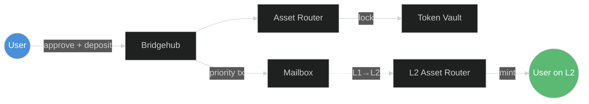
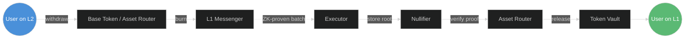
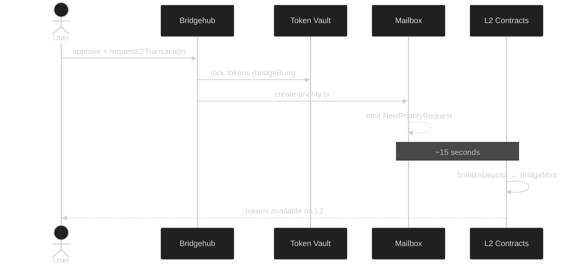
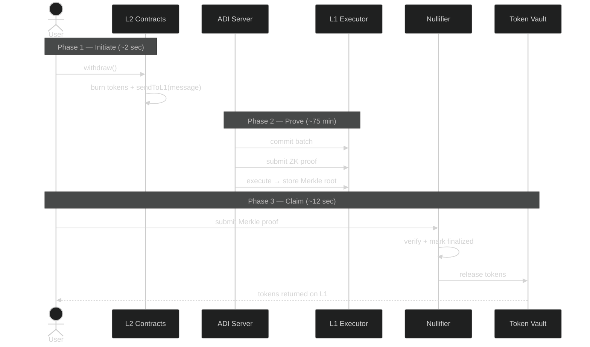
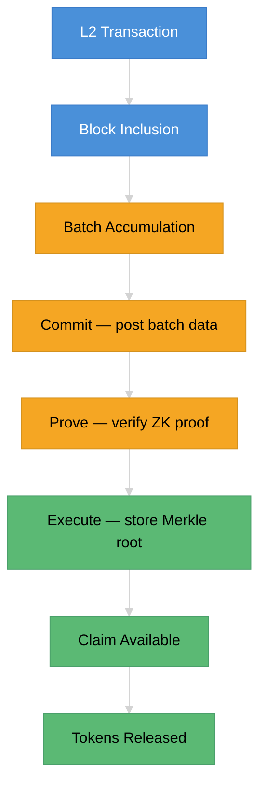

# The Bridge

[The Bridge](https://bridge.adifoundation.ai/) is the native, protocol-level bridge that connects **Ethereum (L1)** with the **ADI Chain**. Unlike third-party bridges that rely on external validators or multisigs, the canonical bridge inherits the full security of the Ethereum mainnet — every cross-chain message is verified through zero-knowledge proofs, making it as secure as Ethereum itself.

The bridge serves two primary purposes:

- **Deposits (L1 → L2)**: Move assets from Ethereum to ADI Chain, where they can be used for transactions, DeFi, and other on-chain activities with significantly lower fees and faster confirmations.
- **Withdrawals (L2 → L1)**: Move assets back from ADI Chain to Ethereum, verified by cryptographic proofs that guarantee correctness without trusting any intermediary.

The bridge supports:

- **Native ADI deposits** — the chain's base gas token
- **ERC20 token deposits** — any standard ERC20
- **First-time token bridging** — automatic contract deployment on the destination chain

### What Makes ADI Different

ADI Chain uses **ADI as its native gas token** instead of ETH. This means:

- All L2 transaction fees are paid in ADI
- When you deposit ADI from L1, it becomes native balance on L2 (like ETH on Ethereum)
- ADI exists as an ERC20 token on Ethereum, and as the native currency on ADI Chain
- Other ERC20 tokens can also be bridged and are represented as wrapped tokens on L2

---

## How It Works — The Big Picture

**Deposit (L1 → L2)** — lock tokens on Ethereum, mint on ADI Chain:

**Withdrawal (L2 → L1)** — burn tokens on L2, prove to Ethereum, claim:

### Core Contracts

| Contract | Layer | Address | Role |
|----------|-------|---------|------|
| **Bridgehub** | L1 | Deployed per ecosystem | Central registry and routing for all L2 chains. Entry point for deposits |
| **L1 Asset Router** | L1 | Deployed per ecosystem | Routes asset operations (lock/unlock) to appropriate asset handlers |
| **L1 Native Token Vault** | L1 | Deployed per ecosystem | Holds locked L1 tokens. Deploys bridged token contracts for L2-native tokens |
| **L1 Nullifier** | L1 | Deployed per ecosystem | Verifies Merkle proofs and prevents double-claiming of withdrawals |
| **Mailbox** | L1 | Per-chain Diamond Proxy | Serializes L1→L2 transactions and manages the priority queue |
| **Executor** | L1 | Per-chain Diamond Proxy | Handles batch commit, prove, and execute lifecycle |
| **L2 Asset Router** | L2 | `0x0000...00010003` | Routes deposits to NTV on L2. Entry point for ERC20 withdrawals |
| **L2 Native Token Vault** | L2 | `0x0000...00010004` | Mints/burns bridged tokens. Deploys new token contracts on first bridge |
| **L1 Messenger** | L2 | `0x0000...00008008` | System contract that sends L2→L1 messages (included in batch proofs) |
| **L2 Base Token** | L2 | `0x0000...0000800A` | System contract representing the chain's base token (ADI) |
| **Contract Deployer** | L2 | `0x0000...00008006` | System contract for deterministic CREATE2 deployments on L2 |

---

## Deposits: Moving Assets to ADI Chain (L1 → L2)

Deposits are fast — typically complete within **~15 seconds**. Since Ethereum is the source of truth, the ADI sequencer can trust L1 events immediately and process them on L2.

### How a Deposit Works

### Step by Step

**Step 1 — Approve**
Before depositing, you authorize the bridge to transfer your tokens. For ADI, this is a standard ERC20 `approve()`. For ERC20 tokens, a separate approval is needed for both the token and ADI (to cover L2 gas).

**Step 2 — Initiate the Deposit**
You submit your deposit through the **Bridgehub** — the central entry point that coordinates all cross-chain transactions. The Bridgehub validates your request and routes it to the appropriate bridge contracts.

**Step 3 — Tokens Are Locked**
The **L1 Asset Router** directs your tokens to the **L1 Native Token Vault**, where they are securely locked. A strict accounting system tracks every token locked per chain, ensuring 1:1 backing at all times.

**Step 4 — Priority Transaction Created**
The **Mailbox** contract registers your deposit as a priority transaction — an L1→L2 message that the sequencer *must* process. This emits a `NewPriorityRequest` event on Ethereum.

**Step 5 — L2 Execution**
The ADI sequencer detects the event, includes it in the next L2 block, and executes it:
- For **ADI deposits**: the bootloader mints native ADI balance to your L2 address
- For **ERC20 deposits**: the L2 Asset Router calls the L2 Native Token Vault, which mints a bridged token representation on L2. If this is the first time a token is being bridged, a new ERC20 contract is automatically deployed on L2 (see [First-Time Token Bridging](../adi-network-components/canonical-bridge.md#first-time-token-bridging)).

**Step 6 — Complete**
Your tokens are now available on ADI Chain. The entire process takes roughly 15 seconds.

### Two Deposit Paths

The bridge uses different entry points depending on the token being deposited:

| Aspect | Direct (`requestL2TransactionDirect`) | Two Bridges (`requestL2TransactionTwoBridges`) |
|--------|---------------------------------------|-----------------------------------------------|
| **Use case** | ADI base token deposits | ERC20 token deposits |
| **Why** | Only one token operation needed (lock ADI) | Two token operations: lock ADI for gas + lock ERC20 |
| **L2 sender** | `msg.sender` (user, aliased if contract) | `secondBridgeAddress` (L1 Asset Router) |
| **L2 target** | Caller-specified | Set by second bridge (L2 Asset Router) |
| **L2 calldata** | Caller-specified | Generated by second bridge (`finalizeDeposit`) |
| **Deposit tracking** | None | `depositHappened` stored for failed deposit recovery |

---

## Withdrawals: Moving Assets Back to Ethereum (L2 → L1)

Withdrawals require more time — typically **about 75 minutes** — because the bridge must generate a zero-knowledge proof to convince Ethereum that your L2 transaction actually happened. This proof-based approach is what gives the canonical bridge its security: no one can fabricate a withdrawal.

### The Three Phases

### Phase 1 — Initiate the Withdrawal on L2

You submit a withdrawal transaction on ADI Chain:
- For **ADI**: call `withdraw()` on the L2 Base Token contract, sending your ADI as `msg.value`
- For **ERC20 tokens**: call `withdraw()` on the L2 Asset Router with the token's asset ID

Your tokens are burned on L2, and the **L1 Messenger** system contract records a withdrawal message. This message is cryptographically committed into a Merkle tree that will later be verified on Ethereum.

### Phase 2 — Batch Processing & Proving

This is where the zero-knowledge magic happens:

1. **Batching**: The ADI server groups multiple L2 blocks into a single batch
2. **Commitment**: The batch data (including the Merkle root of all L2→L1 messages) is posted to Ethereum
3. **Proving**: A zero-knowledge proof is generated, mathematically proving that every transaction in the batch was executed correctly
4. **Execution**: The proof is verified on Ethereum and the batch is finalized. The Merkle root is now stored on-chain, making your withdrawal provable

### Phase 3 — Claim on Ethereum

Once the batch is finalized, you can claim your tokens:

1. The portal fetches a **Merkle proof** for your specific withdrawal
2. You submit a claim transaction to the **L1 Nullifier** contract
3. The Nullifier verifies your Merkle proof against the on-chain root
4. If valid, it marks the withdrawal as finalized (preventing double-claims) and routes the tokens through the **L1 Asset Router** to the **Token Vault**, which releases your tokens

### Why Withdrawals Take Longer Than Deposits

| | Deposits (L1 → L2) | Withdrawals (L2 → L1) |
|---|---|---|
| **Trust model** | L1 is the source of truth — L2 trusts it immediately | L2 must *prove* its state to L1 |
| **Verification** | None needed — L1 events are canonical | ZK proof + Merkle inclusion proof required |
| **Time** | ~15 seconds | ~75 minutes |
| **Why** | Sequencer processes L1 events instantly | ZK proof generation is computationally intensive |

---

## The Settlement Waterfall

Every withdrawal goes through a strict sequence of on-chain verification steps before tokens can be released. This "waterfall" ensures that no invalid state transition can ever result in tokens being unlocked on L1.

Each step in this waterfall is irreversible and verifiable on-chain:

- **Commitment** makes the batch data publicly available
- **Proving** cryptographically guarantees every transaction in the batch is valid
- **Execution** stores the Merkle root, enabling individual withdrawal proofs
- **Claiming** verifies a specific withdrawal against the stored root

### Batch Phases in Detail

| Phase | Function | What Happens | State After |
|-------|----------|-------------|-------------|
| **Commit** | `commitBatchesSharedBridge()` | Batch data posted to L1. L2 system logs validated (timestamps, priority ops hash, L2→L1 message root). DA proof checked. | `totalBatchesCommitted++` |
| **Prove** | `proveBatchesSharedBridge()` | ZK proof verified on-chain. Proof covers state transition from previous batch commitment to current. | `totalBatchesVerified++` |
| **Execute** | `executeBatchesSharedBridge()` | Batch finalized. L2→L1 logs root stored in `l2LogsRootHashes[batchNumber]`. Priority operations marked as processed. Withdrawals become claimable. | `totalBatchesExecuted++` |

Withdrawals cannot be claimed until the batch completes all three phases. Attempting to claim before execution reverts with `LocalRootIsZero` (batch not yet executed) or returns a null proof (batch not yet committed).

---

For a deeper technical dive into the contract methods, token deployment, and security model, see [Canonical Bridge Technical Reference](../adi-network-components/canonical-bridge.md).
