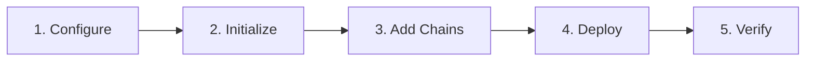

# Overview

This guide walks you through deploying L3 chains on ADI using `adi-cli`. For conceptual background on L3 architecture, see [L3 Chains](../adi-network-components/l3-chains.md).

## Deployment Workflow

The deployment process follows these stages:



| Stage | Command | What Happens |
|-------|---------|--------------|
| Configure | Edit `~/.adi.yml` | Define ecosystem settings, chains, and funding |
| Initialize | `adi init` | Create ecosystem structure and first chain |
| Add Chains | `adi add` | Add additional L3 chains (optional) |
| Deploy | `adi deploy` | Fund wallets and deploy contracts to L2 |
| Verify | `adi ecosystem` | Confirm deployment succeeded |

## Prerequisites

| Requirement | Purpose |
|-------------|---------|
| **Docker** (v20.10+) | The CLI runs blockchain tooling (zkstack, forge) inside containers to ensure reproducible builds across machines |
| **adi-cli** | Command-line tool that orchestrates the deployment process |
| **ADI L2 RPC endpoint** | Your L3 settles transactions on ADI L2, so the CLI needs to connect to it |
| **Funded wallet** | A wallet with ADI on L2 that will fund all ecosystem wallets during deployment |


Docker Desktop and Docker Engine both work. The CLI communicates with Docker via the standard Docker API.


### Verify Your Setup

```bash
# Check adi-cli version
adi version

# Check Docker is running and accessible
docker info

# Test RPC connection (optional)
curl -X POST https://rpc.adi.network \
  -H "Content-Type: application/json" \
  -d '{"jsonrpc":"2.0","method":"eth_chainId","params":[],"id":1}'
```

## Next Steps

- [Configuration](configuration.md) - Set up your ecosystem configuration file
- [Deploy](deploy.md) - Initialize and deploy your L3 chains
